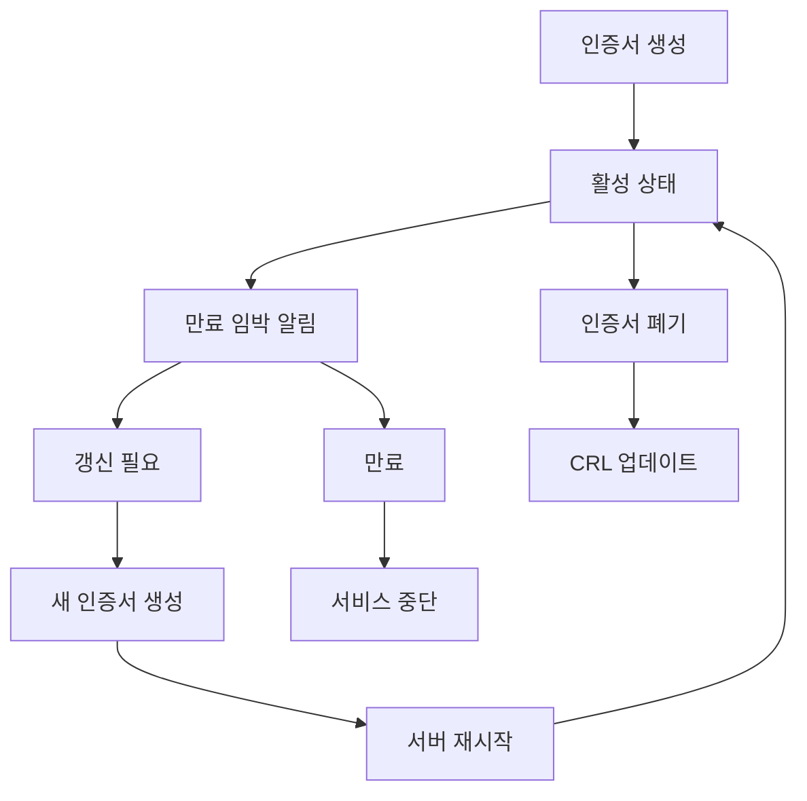

# 6. 인증서 관리 및 모니터링

## 🎯 이 장에서 배울 내용

이 장에서는 사설 인증서의 지속적인 관리와 모니터링에 대해 학습합니다. 인증서 갱신, 만료 알림 설정, 보안 모니터링, 그리고 자동화된 관리 시스템 구축 방법을 다룹니다.

## 🔄 인증서 갱신 관리

### 인증서 수명 주기 이해



### 자동 갱신 스크립트

#### 1. 기본 갱신 스크립트
```bash
#!/bin/bash
# renew-certificates.sh

set -e

# 설정 변수
CERT_DIR="/etc/ssl/certs"
KEY_DIR="/etc/ssl/private"
BACKUP_DIR="/etc/ssl/backup"
LOG_FILE="/var/log/cert-renewal.log"
DAYS_BEFORE_EXPIRY=30

# 로그 함수
log() {
    echo "$(date '+%Y-%m-%d %H:%M:%S') - $1" | tee -a $LOG_FILE
}

# 인증서 만료일 확인
check_certificate_expiry() {
    local cert_file=$1
    local expiry_date=$(openssl x509 -in $cert_file -noout -enddate | cut -d= -f2)
    local expiry_timestamp=$(date -d "$expiry_date" +%s)
    local current_timestamp=$(date +%s)
    local days_until_expiry=$(( (expiry_timestamp - current_timestamp) / 86400 ))
    
    echo $days_until_expiry
}

# 인증서 백업
backup_certificate() {
    local cert_file=$1
    local key_file=$2
    local timestamp=$(date +%Y%m%d_%H%M%S)
    
    mkdir -p $BACKUP_DIR
    cp $cert_file $BACKUP_DIR/$(basename $cert_file).$timestamp
    cp $key_file $BACKUP_DIR/$(basename $key_file).$timestamp
    
    log "인증서 백업 완료: $timestamp"
}

# 새 인증서 생성
generate_new_certificate() {
    local domain=$1
    local cert_file=$2
    local key_file=$3
    
    # 기존 인증서 백업
    backup_certificate $cert_file $key_file
    
    # 새 인증서 생성
    mkcert $domain
    
    # 인증서 파일 이동
    mv $domain.pem $cert_file
    mv $domain-key.pem $key_file
    
    # 권한 설정
    chmod 644 $cert_file
    chmod 600 $key_file
    chown root:root $cert_file $key_file
    
    log "새 인증서 생성 완료: $domain"
}

# 서비스 재시작
restart_services() {
    local services=("nginx" "apache2" "postgresql" "mysql")
    
    for service in "${services[@]}"; do
        if systemctl is-active --quiet $service; then
            systemctl reload $service
            log "서비스 재시작: $service"
        fi
    done
}

# 메인 갱신 로직
renew_certificate() {
    local domain=$1
    local cert_file=$2
    local key_file=$3
    
    if [ ! -f $cert_file ]; then
        log "인증서 파일이 존재하지 않습니다: $cert_file"
        return 1
    fi
    
    local days_until_expiry=$(check_certificate_expiry $cert_file)
    
    if [ $days_until_expiry -le $DAYS_BEFORE_EXPIRY ]; then
        log "인증서 갱신 필요: $domain (만료까지 $days_until_expiry일)"
        generate_new_certificate $domain $cert_file $key_file
        restart_services
        log "인증서 갱신 완료: $domain"
    else
        log "인증서 갱신 불필요: $domain (만료까지 $days_until_expiry일)"
    fi
}

# 스크립트 실행
main() {
    log "인증서 갱신 스크립트 시작"
    
    # localhost 인증서 갱신
    renew_certificate "localhost" "$CERT_DIR/localhost.pem" "$KEY_DIR/localhost-key.pem"
    
    log "인증서 갱신 스크립트 완료"
}

# 스크립트 실행
main "$@"
```

#### 2. 고급 갱신 스크립트 (다중 도메인)
```bash
#!/bin/bash
# advanced-renewal.sh

# 설정 파일
CONFIG_FILE="/etc/ssl/cert-config.conf"

# 설정 파일 예시
cat > $CONFIG_FILE << 'EOF'
# 인증서 설정
CERT_DIR="/etc/ssl/certs"
KEY_DIR="/etc/ssl/private"
BACKUP_DIR="/etc/ssl/backup"
LOG_FILE="/var/log/cert-renewal.log"
DAYS_BEFORE_EXPIRY=30

# 도메인 목록
DOMAINS=(
    "localhost:localhost.pem:localhost-key.pem"
    "api.localhost:api.pem:api-key.pem"
    "admin.localhost:admin.pem:admin-key.pem"
)

# 서비스 목록
SERVICES=("nginx" "apache2")

# 알림 설정
NOTIFICATION_EMAIL="admin@example.com"
SLACK_WEBHOOK="https://hooks.slack.com/services/YOUR/SLACK/WEBHOOK"
EOF

# 설정 파일 로드
source $CONFIG_FILE

# Slack 알림 함수
send_slack_notification() {
    local message=$1
    if [ ! -z "$SLACK_WEBHOOK" ]; then
        curl -X POST -H 'Content-type: application/json' \
            --data "{\"text\":\"🔐 인증서 관리: $message\"}" \
            $SLACK_WEBHOOK
    fi
}

# 이메일 알림 함수
send_email_notification() {
    local subject=$1
    local body=$2
    if [ ! -z "$NOTIFICATION_EMAIL" ]; then
        echo "$body" | mail -s "$subject" $NOTIFICATION_EMAIL
    fi
}

# 인증서 상태 확인
check_certificate_status() {
    local domain=$1
    local cert_file=$2
    
    if [ ! -f $cert_file ]; then
        echo "MISSING"
        return
    fi
    
    local expiry_date=$(openssl x509 -in $cert_file -noout -enddate | cut -d= -f2)
    local expiry_timestamp=$(date -d "$expiry_date" +%s)
    local current_timestamp=$(date +%s)
    local days_until_expiry=$(( (expiry_timestamp - current_timestamp) / 86400 ))
    
    if [ $days_until_expiry -lt 0 ]; then
        echo "EXPIRED"
    elif [ $days_until_expiry -le 7 ]; then
        echo "CRITICAL"
    elif [ $days_until_expiry -le 30 ]; then
        echo "WARNING"
    else
        echo "OK"
    fi
}

# 전체 인증서 상태 리포트
generate_status_report() {
    local report_file="/tmp/cert-status-report.txt"
    
    echo "인증서 상태 리포트 - $(date)" > $report_file
    echo "=================================" >> $report_file
    
    for domain_config in "${DOMAINS[@]}"; do
        IFS=':' read -r domain cert_file key_file <<< "$domain_config"
        local status=$(check_certificate_status $domain $cert_file)
        
        echo "도메인: $domain" >> $report_file
        echo "상태: $status" >> $report_file
        echo "인증서: $cert_file" >> $report_file
        echo "---" >> $report_file
    done
    
    cat $report_file
}

# 메인 갱신 로직
main() {
    log "고급 인증서 갱신 스크립트 시작"
    
    # 상태 리포트 생성
    generate_status_report
    
    # 각 도메인별 갱신 확인
    for domain_config in "${DOMAINS[@]}"; do
        IFS=':' read -r domain cert_file key_file <<< "$domain_config"
        
        local status=$(check_certificate_status $domain $cert_file)
        
        case $status in
            "MISSING")
                log "인증서 파일 누락: $domain"
                send_slack_notification "⚠️ 인증서 파일 누락: $domain"
                ;;
            "EXPIRED")
                log "인증서 만료: $domain"
                send_slack_notification "🚨 인증서 만료: $domain"
                renew_certificate $domain $cert_file $key_file
                ;;
            "CRITICAL")
                log "인증서 갱신 필요 (임박): $domain"
                send_slack_notification "🔴 인증서 갱신 필요 (임박): $domain"
                renew_certificate $domain $cert_file $key_file
                ;;
            "WARNING")
                log "인증서 갱신 권장: $domain"
                send_slack_notification "🟡 인증서 갱신 권장: $domain"
                ;;
            "OK")
                log "인증서 상태 양호: $domain"
                ;;
        esac
    done
    
    log "고급 인증서 갱신 스크립트 완료"
}

# 스크립트 실행
main "$@"
```

## 📧 만료 알림 시스템

### 이메일 알림 설정

#### 1. 이메일 알림 스크립트
```bash
#!/bin/bash
# email-notifications.sh

# 설정
SMTP_SERVER="smtp.gmail.com"
SMTP_PORT="587"
SMTP_USER="your-email@gmail.com"
SMTP_PASS="your-app-password"
FROM_EMAIL="your-email@gmail.com"
TO_EMAIL="admin@example.com"

# 이메일 전송 함수
send_email() {
    local subject=$1
    local body=$2
    
    {
        echo "To: $TO_EMAIL"
        echo "From: $FROM_EMAIL"
        echo "Subject: $subject"
        echo "Content-Type: text/html; charset=UTF-8"
        echo ""
        echo "$body"
    } | sendmail -S $SMTP_SERVER:$SMTP_PORT -au$SMTP_USER -ap$SMTP_PASS $TO_EMAIL
}

# HTML 이메일 템플릿
generate_html_email() {
    local domain=$1
    local days_until_expiry=$2
    local status=$3
    
    cat << EOF
<!DOCTYPE html>
<html>
<head>
    <meta charset="UTF-8">
    <title>인증서 만료 알림</title>
    <style>
        body { font-family: Arial, sans-serif; margin: 20px; }
        .header { background: #f8f9fa; padding: 20px; border-radius: 5px; }
        .warning { background: #fff3cd; border: 1px solid #ffeaa7; padding: 15px; border-radius: 5px; }
        .critical { background: #f8d7da; border: 1px solid #f5c6cb; padding: 15px; border-radius: 5px; }
        .info { background: #d1ecf1; border: 1px solid #bee5eb; padding: 15px; border-radius: 5px; }
        .footer { margin-top: 20px; font-size: 12px; color: #666; }
    </style>
</head>
<body>
    <div class="header">
        <h1>🔐 인증서 만료 알림</h1>
        <p>도메인: <strong>$domain</strong></p>
        <p>만료까지: <strong>$days_until_expiry일</strong></p>
    </div>
    
    <div class="$status">
        <h2>상태: $status</h2>
        <p>인증서가 곧 만료됩니다. 즉시 갱신이 필요합니다.</p>
    </div>
    
    <div class="info">
        <h3>권장 조치사항:</h3>
        <ul>
            <li>인증서 갱신 스크립트 실행</li>
            <li>서비스 재시작</li>
            <li>연결 테스트 수행</li>
        </ul>
    </div>
    
    <div class="footer">
        <p>이 알림은 자동으로 생성되었습니다.</p>
        <p>생성 시간: $(date)</p>
    </div>
</body>
</html>
EOF
}

# 알림 전송 로직
send_certificate_notification() {
    local domain=$1
    local days_until_expiry=$2
    
    local status
    if [ $days_until_expiry -le 0 ]; then
        status="critical"
        subject="🚨 인증서 만료: $domain"
    elif [ $days_until_expiry -le 7 ]; then
        status="warning"
        subject="⚠️ 인증서 만료 임박: $domain"
    elif [ $days_until_expiry -le 30 ]; then
        status="info"
        subject="ℹ️ 인증서 갱신 권장: $domain"
    else
        return 0
    fi
    
    local body=$(generate_html_email $domain $days_until_expiry $status)
    send_email "$subject" "$body"
    
    log "알림 전송 완료: $domain ($status)"
}
```

### Slack 알림 설정

#### 1. Slack 웹훅 설정
```bash
#!/bin/bash
# slack-notifications.sh

# Slack 웹훅 URL
SLACK_WEBHOOK="https://hooks.slack.com/services/YOUR/SLACK/WEBHOOK"

# Slack 메시지 전송
send_slack_message() {
    local message=$1
    local color=$2
    
    local payload=$(cat << EOF
{
    "attachments": [
        {
            "color": "$color",
            "title": "🔐 인증서 관리 알림",
            "text": "$message",
            "footer": "인증서 관리 시스템",
            "ts": $(date +%s)
        }
    ]
}
EOF
)
    
    curl -X POST -H 'Content-type: application/json' \
        --data "$payload" \
        $SLACK_WEBHOOK
}

# 인증서 상태별 Slack 메시지
send_certificate_slack_notification() {
    local domain=$1
    local days_until_expiry=$2
    local status=$3
    
    case $status in
        "EXPIRED")
            send_slack_message "🚨 인증서 만료: $domain\n⏰ 만료일: $(date -d "+$days_until_expiry days")\n🔧 즉시 갱신 필요" "danger"
            ;;
        "CRITICAL")
            send_slack_message "🔴 인증서 만료 임박: $domain\n⏰ 만료까지: $days_until_expiry일\n🔧 갱신 권장" "warning"
            ;;
        "WARNING")
            send_slack_message "🟡 인증서 갱신 권장: $domain\n⏰ 만료까지: $days_until_expiry일\n📋 갱신 계획 수립" "warning"
            ;;
        "OK")
            send_slack_message "✅ 인증서 상태 양호: $domain\n⏰ 만료까지: $days_until_expiry일" "good"
            ;;
    esac
}
```

## 📊 모니터링 대시보드

### 웹 기반 모니터링 대시보드

#### 1. Node.js 모니터링 서버
```javascript
// monitoring-server.js
const express = require('express');
const https = require('https');
const fs = require('fs');
const { exec } = require('child_process');
const path = require('path');

const app = express();
app.use(express.json());
app.use(express.static('public'));

// 인증서 정보 수집
async function getCertificateInfo(certPath) {
    return new Promise((resolve, reject) => {
        exec(`openssl x509 -in ${certPath} -noout -text`, (error, stdout, stderr) => {
            if (error) {
                reject(error);
                return;
            }
            
            const info = {
                subject: extractField(stdout, 'Subject:'),
                issuer: extractField(stdout, 'Issuer:'),
                notBefore: extractField(stdout, 'Not Before:'),
                notAfter: extractField(stdout, 'Not After:'),
                serialNumber: extractField(stdout, 'Serial Number:'),
                signatureAlgorithm: extractField(stdout, 'Signature Algorithm:'),
                publicKey: extractField(stdout, 'Public Key Algorithm:'),
                keySize: extractKeySize(stdout)
            };
            
            resolve(info);
        });
    });
}

// 필드 추출 함수
function extractField(text, field) {
    const regex = new RegExp(`${field}\\s*([^\\n]+)`);
    const match = text.match(regex);
    return match ? match[1].trim() : null;
}

// 키 크기 추출
function extractKeySize(text) {
    const regex = /Public-Key: \(([0-9]+) bit\)/;
    const match = text.match(regex);
    return match ? parseInt(match[1]) : null;
}

// 인증서 상태 확인
async function checkCertificateStatus(certPath) {
    try {
        const info = await getCertificateInfo(certPath);
        const notAfter = new Date(info.notAfter);
        const now = new Date();
        const daysUntilExpiry = Math.ceil((notAfter - now) / (1000 * 60 * 60 * 24));
        
        let status;
        if (daysUntilExpiry < 0) {
            status = 'EXPIRED';
        } else if (daysUntilExpiry <= 7) {
            status = 'CRITICAL';
        } else if (daysUntilExpiry <= 30) {
            status = 'WARNING';
        } else {
            status = 'OK';
        }
        
        return {
            ...info,
            daysUntilExpiry,
            status,
            lastChecked: new Date().toISOString()
        };
    } catch (error) {
        return {
            error: error.message,
            status: 'ERROR',
            lastChecked: new Date().toISOString()
        };
    }
}

// API 엔드포인트
app.get('/api/certificates', async (req, res) => {
    try {
        const certificates = [
            { name: 'localhost', path: './localhost.pem' },
            { name: 'api.localhost', path: './api.pem' },
            { name: 'admin.localhost', path: './admin.pem' }
        ];
        
        const results = await Promise.all(
            certificates.map(async (cert) => {
                const status = await checkCertificateStatus(cert.path);
                return {
                    name: cert.name,
                    path: cert.path,
                    ...status
                };
            })
        );
        
        res.json(results);
    } catch (error) {
        res.status(500).json({ error: error.message });
    }
});

app.get('/api/certificates/:name', async (req, res) => {
    try {
        const { name } = req.params;
        const certPath = `./${name}.pem`;
        const status = await checkCertificateStatus(certPath);
        
        res.json({
            name,
            path: certPath,
            ...status
        });
    } catch (error) {
        res.status(500).json({ error: error.message });
    }
});

// 대시보드 HTML
app.get('/', (req, res) => {
    res.send(`
        <!DOCTYPE html>
        <html lang="ko">
        <head>
            <meta charset="UTF-8">
            <meta name="viewport" content="width=device-width, initial-scale=1.0">
            <title>인증서 모니터링 대시보드</title>
            <style>
                body { font-family: Arial, sans-serif; margin: 20px; background: #f5f5f5; }
                .container { max-width: 1200px; margin: 0 auto; }
                .header { background: white; padding: 20px; border-radius: 8px; margin-bottom: 20px; box-shadow: 0 2px 4px rgba(0,0,0,0.1); }
                .card { background: white; padding: 20px; border-radius: 8px; margin-bottom: 20px; box-shadow: 0 2px 4px rgba(0,0,0,0.1); }
                .status { padding: 4px 8px; border-radius: 4px; color: white; font-weight: bold; }
                .status.OK { background: #28a745; }
                .status.WARNING { background: #ffc107; color: #000; }
                .status.CRITICAL { background: #dc3545; }
                .status.EXPIRED { background: #6c757d; }
                .status.ERROR { background: #6c757d; }
                .refresh-btn { background: #007bff; color: white; border: none; padding: 10px 20px; border-radius: 4px; cursor: pointer; }
                .refresh-btn:hover { background: #0056b3; }
                table { width: 100%; border-collapse: collapse; }
                th, td { padding: 12px; text-align: left; border-bottom: 1px solid #ddd; }
                th { background: #f8f9fa; }
            </style>
        </head>
        <body>
            <div class="container">
                <div class="header">
                    <h1>🔐 인증서 모니터링 대시보드</h1>
                    <p>실시간 인증서 상태 모니터링</p>
                    <button class="refresh-btn" onclick="refreshData()">새로고침</button>
                </div>
                
                <div class="card">
                    <h2>인증서 상태</h2>
                    <div id="certificates-table">
                        <p>데이터 로딩 중...</p>
                    </div>
                </div>
            </div>
            
            <script>
                async function loadCertificates() {
                    try {
                        const response = await fetch('/api/certificates');
                        const certificates = await response.json();
                        
                        const table = document.createElement('table');
                        table.innerHTML = \`
                            <thead>
                                <tr>
                                    <th>인증서명</th>
                                    <th>상태</th>
                                    <th>만료일</th>
                                    <th>남은 일수</th>
                                    <th>마지막 확인</th>
                                </tr>
                            </thead>
                            <tbody>
                                \${certificates.map(cert => \`
                                    <tr>
                                        <td>\${cert.name}</td>
                                        <td><span class="status \${cert.status}">\${cert.status}</span></td>
                                        <td>\${cert.notAfter || 'N/A'}</td>
                                        <td>\${cert.daysUntilExpiry || 'N/A'}</td>
                                        <td>\${new Date(cert.lastChecked).toLocaleString()}</td>
                                    </tr>
                                \`).join('')}
                            </tbody>
                        \`;
                        
                        document.getElementById('certificates-table').innerHTML = '';
                        document.getElementById('certificates-table').appendChild(table);
                    } catch (error) {
                        document.getElementById('certificates-table').innerHTML = \`<p>오류: \${error.message}</p>\`;
                    }
                }
                
                function refreshData() {
                    loadCertificates();
                }
                
                // 초기 로드
                loadCertificates();
                
                // 5분마다 자동 새로고침
                setInterval(loadCertificates, 5 * 60 * 1000);
            </script>
        </body>
        </html>
    `);
});

// HTTPS 서버 시작
const options = {
    key: fs.readFileSync('localhost-key.pem'),
    cert: fs.readFileSync('localhost.pem')
};

https.createServer(options, app).listen(443, () => {
    console.log('🔍 모니터링 서버가 https://localhost에서 실행 중입니다.');
});
```

## 🔍 보안 모니터링

### 인증서 보안 검사

#### 1. 보안 검사 스크립트
```bash
#!/bin/bash
# security-audit.sh

# 보안 검사 함수
audit_certificate_security() {
    local cert_file=$1
    local domain=$2
    
    echo "🔍 보안 검사 시작: $domain"
    echo "================================="
    
    # 1. 인증서 유효성 검사
    echo "1. 인증서 유효성 검사"
    if openssl x509 -in $cert_file -noout -checkend 0; then
        echo "✅ 인증서가 유효합니다"
    else
        echo "❌ 인증서가 만료되었거나 유효하지 않습니다"
    fi
    
    # 2. 키 크기 검사
    echo "2. 키 크기 검사"
    local key_size=$(openssl x509 -in $cert_file -noout -text | grep "Public-Key:" | grep -o "[0-9]*")
    if [ $key_size -ge 2048 ]; then
        echo "✅ 키 크기가 충분합니다: $key_size bits"
    else
        echo "❌ 키 크기가 부족합니다: $key_size bits (최소 2048 bits 권장)"
    fi
    
    # 3. 서명 알고리즘 검사
    echo "3. 서명 알고리즘 검사"
    local sig_algo=$(openssl x509 -in $cert_file -noout -text | grep "Signature Algorithm:" | head -1 | cut -d: -f2 | tr -d ' ')
    if [[ $sig_algo == *"sha256"* ]] || [[ $sig_algo == *"sha384"* ]] || [[ $sig_algo == *"sha512"* ]]; then
        echo "✅ 서명 알고리즘이 안전합니다: $sig_algo"
    else
        echo "❌ 서명 알고리즘이 취약할 수 있습니다: $sig_algo"
    fi
    
    # 4. 키 사용법 검사
    echo "4. 키 사용법 검사"
    local key_usage=$(openssl x509 -in $cert_file -noout -text | grep -A 5 "Key Usage:")
    echo "키 사용법: $key_usage"
    
    # 5. 확장 키 사용법 검사
    echo "5. 확장 키 사용법 검사"
    local ext_key_usage=$(openssl x509 -in $cert_file -noout -text | grep -A 5 "Extended Key Usage:")
    echo "확장 키 사용법: $ext_key_usage"
    
    # 6. 주체 대체 이름 검사
    echo "6. 주체 대체 이름 검사"
    local san=$(openssl x509 -in $cert_file -noout -text | grep -A 5 "Subject Alternative Name:")
    if [ ! -z "$san" ]; then
        echo "✅ 주체 대체 이름이 설정되어 있습니다"
        echo "$san"
    else
        echo "⚠️ 주체 대체 이름이 설정되어 있지 않습니다"
    fi
    
    echo ""
}

# 메인 보안 검사
main() {
    local certificates=(
        "localhost:./localhost.pem"
        "api.localhost:./api.pem"
        "admin.localhost:./admin.pem"
    )
    
    for cert_config in "${certificates[@]}"; do
        IFS=':' read -r domain cert_file <<< "$cert_config"
        if [ -f "$cert_file" ]; then
            audit_certificate_security "$cert_file" "$domain"
        else
            echo "❌ 인증서 파일을 찾을 수 없습니다: $cert_file"
        fi
    done
}

# 스크립트 실행
main "$@"
```

## 📚 다음 단계

이제 인증서 관리 및 모니터링에 대해 배웠습니다. 마지막 장에서는 문제 해결 및 FAQ에 대해 알아보겠습니다.

**다음: [7. 문제 해결 및 FAQ](./07-troubleshooting.md)**

---

## 💡 핵심 정리

- **자동 갱신**: 스크립트를 통한 인증서 자동 갱신
- **알림 시스템**: 이메일, Slack을 통한 만료 알림
- **모니터링 대시보드**: 웹 기반 실시간 모니터링
- **보안 검사**: 정기적인 보안 감사 수행
- **자동화**: 전체 인증서 생명주기 자동화
