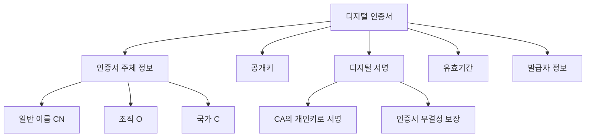
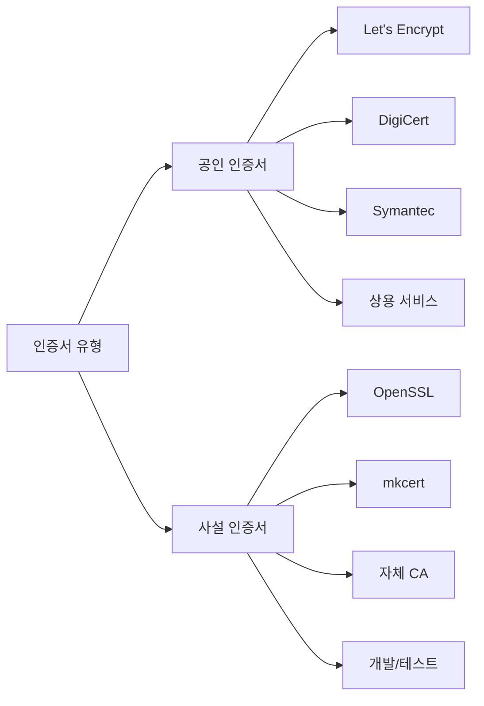
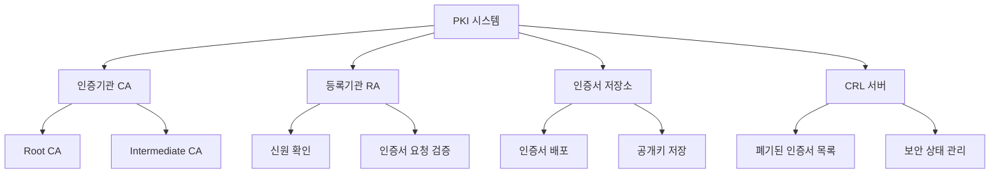
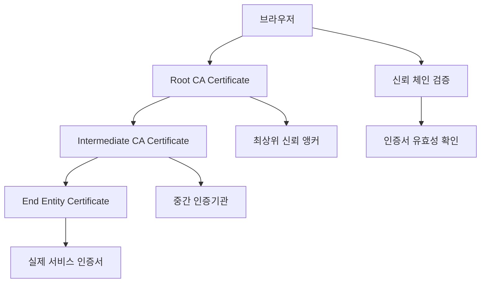
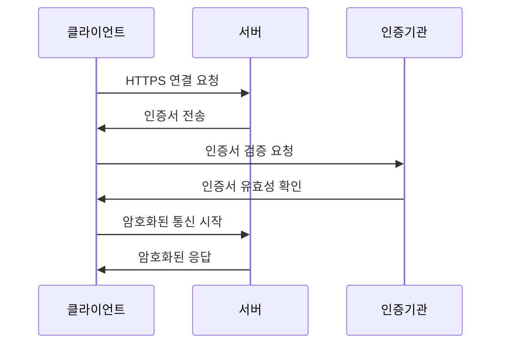

# 1. 기본 개념 이해

## 🎯 이 장에서 배울 내용

이 장에서는 사설 인증서를 이해하기 위해 필요한 기본 개념들을 학습합니다. 인증서가 무엇인지, 왜 필요한지, 그리고 어떻게 작동하는지에 대해 알아보겠습니다.

## 📖 인증서란 무엇인가?

### 정의
**디지털 인증서(Digital Certificate)**는 공개키 암호화 시스템에서 사용되는 전자 문서로, 특정 개체(사람, 조직, 서버 등)의 신원을 확인하고 공개키를 안전하게 배포하는 데 사용됩니다.

### 인증서의 핵심 구성 요소

### 인증서의 주요 필드

| 필드 | 설명 | 예시 |
|------|------|------|
| **CN (Common Name)** | 인증서의 주체 이름 | `example.com` |
| **O (Organization)** | 조직명 | `My Company Inc.` |
| **OU (Organizational Unit)** | 조직 단위 | `IT Department` |
| **C (Country)** | 국가 코드 | `KR` |
| **ST (State)** | 주/도 | `Seoul` |
| **L (Locality)** | 도시 | `Seoul` |
| **Email** | 이메일 주소 | `admin@example.com` |

## 🔐 공인 인증서 vs 사설 인증서

### 공인 인증서 (Public Certificate)

**특징:**
- 공인 인증기관(CA)에서 발급
- 브라우저에 기본적으로 신뢰됨
- 유료 서비스
- 높은 보안 수준

**사용 사례:**
- 상용 웹사이트
- 전자상거래
- 금융 서비스
- 공공기관

### 사설 인증서 (Private Certificate)

**특징:**
- 자체 인증기관에서 발급
- 브라우저에서 경고 표시
- 무료
- 개발/테스트 환경에 적합

**사용 사례:**
- 개발 환경
- 내부 시스템
- 테스트 서버
- 로컬 개발

## 🏗️ PKI (Public Key Infrastructure) 이해

### PKI의 구성 요소

### 인증서 체인 (Certificate Chain)

## 🔧 인증서의 구성 요소

### 1. 공개키 (Public Key)
- 암호화에 사용
- 공개적으로 배포 가능
- 인증서에 포함됨

### 2. 개인키 (Private Key)
- 복호화에 사용
- 비밀로 보관
- 서버에만 저장

### 3. 디지털 서명 (Digital Signature)
- CA의 개인키로 생성
- 인증서의 무결성 보장
- 위조 방지

### 4. 메타데이터
- 발급일/만료일
- 발급자 정보
- 사용 목적
- 키 사용법

## 🔄 인증서 작동 원리

### HTTPS 연결 과정

### 인증서 검증 과정

1. **서명 검증**: CA의 공개키로 인증서 서명 확인
2. **유효기간 확인**: 현재 날짜가 유효기간 내인지 확인
3. **체인 검증**: Root CA까지의 신뢰 체인 확인
4. **도메인 확인**: 인증서의 CN이 요청 도메인과 일치하는지 확인
5. **폐기 상태 확인**: CRL 또는 OCSP를 통한 폐기 상태 확인

## 🎯 왜 사설 인증서를 사용하는가?

### 개발 환경에서의 필요성

1. **로컬 개발**: `localhost`에서 HTTPS 테스트
2. **개발 서버**: 내부 네트워크에서 HTTPS 사용
3. **테스트 환경**: 실제 프로덕션과 유사한 환경 구축
4. **비용 절감**: 공인 인증서 구매 비용 절약

### 사설 인증서의 장점

- ✅ **무료**: 추가 비용 없음
- ✅ **빠른 발급**: 즉시 생성 가능
- ✅ **유연성**: 원하는 설정으로 생성
- ✅ **개발 친화적**: 개발 환경에 최적화

### 사설 인증서의 단점

- ❌ **브라우저 경고**: 신뢰되지 않는 인증서 경고
- ❌ **수동 설정**: 브라우저에 수동으로 신뢰 설정 필요
- ❌ **보안 수준**: 공인 인증서 대비 낮은 보안 수준
- ❌ **배포 제한**: 외부 사용자에게 배포 시 문제

## 📚 다음 단계

이제 기본 개념을 이해했으니, 다음 장에서는 사설 인증서가 왜 필요한지에 대해 더 자세히 알아보겠습니다.

**다음: [2. 사설 인증서가 필요한 이유](./02-why-private-certificates.md)**

---

## 💡 핵심 정리

- **인증서**는 디지털 신원 확인과 공개키 배포를 위한 전자 문서
- **공인 인증서**는 상용 서비스에, **사설 인증서**는 개발/테스트에 적합
- **PKI**는 인증서 기반 보안 인프라의 핵심
- **사설 인증서**는 개발 환경에서 HTTPS 테스트를 위한 필수 도구
