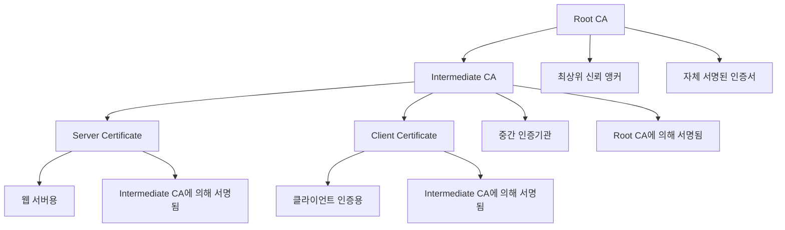

# 3. OpenSSL을 이용한 인증서 발급

## 🎯 이 장에서 배울 내용

이 장에서는 OpenSSL을 사용하여 사설 인증서를 직접 생성하고 관리하는 방법을 단계별로 학습합니다. Root CA 생성부터 서버 인증서 발급까지 전체 과정을 다룹니다.

## 🔧 OpenSSL 설치 및 설정

### macOS에서 OpenSSL 설치
```bash
# Homebrew 사용
brew install openssl

# 환경변수 설정
echo 'export PATH="/usr/local/opt/openssl/bin:$PATH"' >> ~/.zshrc
source ~/.zshrc
```

### Linux에서 OpenSSL 설치
```bash
# Ubuntu/Debian
sudo apt-get update
sudo apt-get install openssl

# CentOS/RHEL
sudo yum install openssl
# 또는
sudo dnf install openssl
```

### 설치 확인
```bash
openssl version
# OpenSSL 3.0.7 1 Nov 2022
```

## 📁 프로젝트 구조 설정

### 디렉토리 구조 생성
```bash
# 인증서 관련 디렉토리 생성
mkdir -p certs/{ca,server,client}
mkdir -p config
mkdir -p scripts
```

### 최종 디렉토리 구조
```
private-certificate-tutorial/
├── certs/
│   ├── ca/           # Root CA 관련 파일
│   ├── server/       # 서버 인증서
│   └── client/       # 클라이언트 인증서
├── config/           # 설정 파일
├── scripts/          # 자동화 스크립트
├── docs/
└── README.md
```

## 🏗️ Root CA (인증기관) 생성

### Root CA가 필요한 이유



Root CA(Certificate Authority)는 인증서 체계의 최상위 계층으로, 다음과 같은 중요한 역할을 담당합니다:

#### 🔐 신뢰의 근원 (Trust Anchor)
- **최상위 신뢰점**: 모든 인증서의 신뢰성은 결국 Root CA에서 시작됩니다
- **자체 서명**: Root CA는 자신의 인증서를 스스로 서명하므로, 외부 의존성 없이 독립적으로 운영 가능합니다
- **신뢰 체인**: Root CA → Intermediate CA → End Entity Certificate의 계층적 신뢰 구조를 형성합니다

#### 🛡️ 보안 및 관리의 이점
- **중앙 집중식 관리**: 하나의 Root CA로 전체 인증서 생태계를 관리할 수 있습니다
- **권한 분리**: Root CA는 오프라인으로 보관하고, Intermediate CA가 일상적인 인증서 발급을 담당합니다
- **위험 분산**: Root CA가 노출되더라도 Intermediate CA를 통해 신속하게 대응할 수 있습니다

#### 🏢 조직적 필요성
- **내부 인프라**: 회사 내부 서버, 애플리케이션, IoT 디바이스에 대한 인증서 발급
- **비용 절약**: 상용 CA의 인증서 구매 비용을 절약할 수 있습니다
- **커스터마이징**: 조직의 정책에 맞는 인증서 발급 규칙을 설정할 수 있습니다

#### 🔄 확장성과 유연성
- **무제한 발급**: 필요에 따라 원하는 만큼의 인증서를 발급할 수 있습니다
- **다양한 용도**: 서버 인증, 클라이언트 인증, 코드 서명 등 다양한 목적의 인증서 발급 가능
- **기간 제어**: 인증서 유효 기간을 조직 정책에 맞게 설정할 수 있습니다

### 1단계: Root CA 개인키 생성
```bash
# 4096비트 RSA 개인키 생성
openssl genrsa -out certs/ca/ca-key.pem 4096

# 키 파일 권한 설정 (보안)
chmod 600 certs/ca/ca-key.pem
```

### 2단계: Root CA 인증서 생성
```bash
# Root CA 인증서 생성 (10년 유효)
openssl req -new -x509 -days 3650 -key certs/ca/ca-key.pem -out certs/ca/ca-cert.pem -subj "/C=KR/ST=Seoul/L=Seoul/O=MyCompany/OU=IT/CN=MyCompany Root CA"
```

### 3단계: Root CA 설정 파일 생성
```bash
# ca.conf 파일 생성
cat > config/ca.conf << 'EOF'
[ ca ]
default_ca = CA_default

[ CA_default ]
dir = ./certs/ca
certs = $dir
crl_dir = $dir/crl
new_certs_dir = $dir/newcerts
database = $dir/index.txt
serial = $dir/serial
RANDFILE = $dir/.rand

private_key = $dir/ca-key.pem
certificate = $dir/ca-cert.pem

crlnumber = $dir/crlnumber
crl = $dir/crl.pem
crl_extensions = crl_ext
default_crl_days = 30

default_md = sha256
name_opt = ca_default
cert_opt = ca_default
default_days = 365
preserve = no
policy = policy_strict

[ policy_strict ]
countryName = match
stateOrProvinceName = match
organizationName = match
organizationalUnitName = optional
commonName = supplied
emailAddress = optional

[ policy_loose ]
countryName = optional
stateOrProvinceName = optional
localityName = optional
organizationName = optional
organizationalUnitName = optional
commonName = supplied
emailAddress = optional

[ req ]
default_bits = 4096
distinguished_name = req_distinguished_name
string_mask = utf8only
default_md = sha256
x509_extensions = v3_ca

[ req_distinguished_name ]
countryName = Country Name (2 letter code)
stateOrProvinceName = State or Province Name
localityName = Locality Name
0.organizationName = Organization Name
organizationalUnitName = Organizational Unit Name
commonName = Common Name
emailAddress = Email Address

[ v3_ca ]
subjectKeyIdentifier = hash
authorityKeyIdentifier = keyid:always,issuer
basicConstraints = critical, CA:true
keyUsage = critical, digitalSignature, cRLSign, keyCertSign

[ v3_intermediate_ca ]
subjectKeyIdentifier = hash
authorityKeyIdentifier = keyid:always,issuer
basicConstraints = critical, CA:true, pathlen:0
keyUsage = critical, digitalSignature, cRLSign, keyCertSign

[ usr_cert ]
basicConstraints = CA:FALSE
nsCertType = client, email
nsComment = "OpenSSL Generated Client Certificate"
subjectKeyIdentifier = hash
authorityKeyIdentifier = keyid,issuer
keyUsage = critical, nonRepudiation, digitalSignature, keyEncipherment
extendedKeyUsage = clientAuth, emailProtection

[ server_cert ]
basicConstraints = CA:FALSE
nsCertType = server
nsComment = "OpenSSL Generated Server Certificate"
subjectKeyIdentifier = hash
authorityKeyIdentifier = keyid,issuer:always
keyUsage = critical, digitalSignature, keyEncipherment
extendedKeyUsage = serverAuth

[ crl_ext ]
authorityKeyIdentifier = keyid:always
EOF
```

### 4단계: CA 데이터베이스 초기화
```bash
# 필요한 디렉토리 생성
mkdir -p certs/ca/{newcerts,crl}

# CA 데이터베이스 파일 생성
touch certs/ca/index.txt
echo 1000 > certs/ca/serial
echo 1000 > certs/ca/crlnumber
```

## 🖥️ 서버 인증서 발급

### 1단계: 서버 개인키 생성
```bash
# 서버 개인키 생성
openssl genrsa -out certs/server/server-key.pem 4096
chmod 600 certs/server/server-key.pem
```

### 2단계: 서버 인증서 요청서(CSR) 생성
```bash
# 서버 CSR 생성
openssl req -new -key certs/server/server-key.pem -out certs/server/server.csr -subj "/C=KR/ST=Seoul/L=Seoul/O=MyCompany/OU=IT/CN=localhost"
```

### 3단계: 서버 인증서 서명
```bash
# Root CA로 서버 인증서 서명
openssl ca -config config/ca.conf -extensions server_cert -days 365 -notext -md sha256 -in certs/server/server.csr -out certs/server/server-cert.pem
```

### 4단계: 서버 인증서 검증
```bash
# 인증서 내용 확인
openssl x509 -in certs/server/server-cert.pem -text -noout

# 인증서 체인 검증
openssl verify -CAfile certs/ca/ca-cert.pem certs/server/server-cert.pem
```

## 👤 클라이언트 인증서 발급

### 1단계: 클라이언트 개인키 생성
```bash
# 클라이언트 개인키 생성
openssl genrsa -out certs/client/client-key.pem 4096
chmod 600 certs/client/client-key.pem
```

### 2단계: 클라이언트 인증서 요청서 생성
```bash
# 클라이언트 CSR 생성
openssl req -new -key certs/client/client-key.pem -out certs/client/client.csr -subj "/C=KR/ST=Seoul/L=Seoul/O=MyCompany/OU=IT/CN=client"
```

### 3단계: 클라이언트 인증서 서명
```bash
# Root CA로 클라이언트 인증서 서명
openssl ca -config config/ca.conf -extensions usr_cert -days 365 -notext -md sha256 -in certs/client/client.csr -out certs/client/client-cert.pem
```

### 4단계: 클라이언트 인증서를 PKCS#12 형식으로 변환
```bash
# PKCS#12 형식으로 변환 (브라우저에서 사용 가능)
openssl pkcs12 -export -out certs/client/client.p12 -inkey certs/client/client-key.pem -in certs/client/client-cert.pem -certfile certs/ca/ca-cert.pem
```

## 🔧 자동화 스크립트 생성

### 인증서 생성 스크립트
```bash
# scripts/generate-certs.sh
#!/bin/bash

set -e

echo "🔐 사설 인증서 생성 스크립트"
echo "================================"

# 디렉토리 생성
mkdir -p certs/{ca,server,client}
mkdir -p certs/ca/{newcerts,crl}
mkdir -p config

# Root CA 생성
echo "📋 Root CA 생성 중..."
openssl genrsa -out certs/ca/ca-key.pem 4096
chmod 600 certs/ca/ca-key.pem

openssl req -new -x509 -days 3650 -key certs/ca/ca-key.pem -out certs/ca/ca-cert.pem \
    -subj "/C=KR/ST=Seoul/L=Seoul/O=MyCompany/OU=IT/CN=MyCompany Root CA"

# CA 데이터베이스 초기화
touch certs/ca/index.txt
echo 1000 > certs/ca/serial
echo 1000 > certs/ca/crlnumber

# 서버 인증서 생성
echo "🖥️ 서버 인증서 생성 중..."
openssl genrsa -out certs/server/server-key.pem 4096
chmod 600 certs/server/server-key.pem

openssl req -new -key certs/server/server-key.pem -out certs/server/server.csr \
    -subj "/C=KR/ST=Seoul/L=Seoul/O=MyCompany/OU=IT/CN=localhost"

openssl ca -config config/ca.conf -extensions server_cert -days 365 -notext -md sha256 \
    -in certs/server/server.csr -out certs/server/server-cert.pem

# 클라이언트 인증서 생성
echo "👤 클라이언트 인증서 생성 중..."
openssl genrsa -out certs/client/client-key.pem 4096
chmod 600 certs/client/client-key.pem

openssl req -new -key certs/client/client-key.pem -out certs/client/client.csr \
    -subj "/C=KR/ST=Seoul/L=Seoul/O=MyCompany/OU=IT/CN=client"

openssl ca -config config/ca.conf -extensions usr_cert -days 365 -notext -md sha256 \
    -in certs/client/client.csr -out certs/client/client-cert.pem

# PKCS#12 형식으로 변환
openssl pkcs12 -export -out certs/client/client.p12 -inkey certs/client/client-key.pem \
    -in certs/client/client-cert.pem -certfile certs/ca/ca-cert.pem

echo "✅ 모든 인증서가 성공적으로 생성되었습니다!"
echo ""
echo "📁 생성된 파일들:"
echo "  - Root CA: certs/ca/ca-cert.pem"
echo "  - 서버 인증서: certs/server/server-cert.pem"
echo "  - 서버 키: certs/server/server-key.pem"
echo "  - 클라이언트 인증서: certs/client/client-cert.pem"
echo "  - 클라이언트 키: certs/client/client-key.pem"
echo "  - 클라이언트 PKCS#12: certs/client/client.p12"
```

### 스크립트 실행 권한 부여
```bash
chmod +x scripts/generate-certs.sh
```

## 🧪 인증서 테스트

### 1. 인증서 정보 확인
```bash
# Root CA 인증서 정보
openssl x509 -in certs/ca/ca-cert.pem -text -noout

# 서버 인증서 정보
openssl x509 -in certs/server/server-cert.pem -text -noout

# 클라이언트 인증서 정보
openssl x509 -in certs/client/client-cert.pem -text -noout
```

**예상 결과:**
```
Certificate:
    Data:
        Version: 3 (0x2)
        Serial Number: 1000 (0x3e8)
        Signature Algorithm: sha256WithRSAEncryption
        Issuer: C=KR, ST=Seoul, L=Seoul, O=MyCompany, OU=IT, CN=MyCompany Root CA
        Validity
            Not Before: Jan  1 00:00:00 2024 GMT
            Not After : Dec 31 23:59:59 2033 GMT
        Subject: C=KR, ST=Seoul, L=Seoul, O=MyCompany, OU=IT, CN=localhost
        Subject Public Key Info:
            Public Key Algorithm: rsaEncryption
                Public-Key: (4096 bit)
        X509v3 extensions:
            X509v3 Basic Constraints:
                CA:FALSE
            X509v3 Key Usage:
                Digital Signature, Key Encipherment
            X509v3 Extended Key Usage:
                TLS Web Server Authentication
    Signature Algorithm: sha256WithRSAEncryption
```

### 2. 인증서 체인 검증
```bash
# 서버 인증서 검증
openssl verify -CAfile certs/ca/ca-cert.pem certs/server/server-cert.pem

# 클라이언트 인증서 검증
openssl verify -CAfile certs/ca/ca-cert.pem certs/client/client-cert.pem
```

**예상 결과:**
```bash
# 서버 인증서 검증 성공
certs/server/server-cert.pem: OK

# 클라이언트 인증서 검증 성공
certs/client/client-cert.pem: OK
```

**❌ 실패 시 나타나는 오류:**
```bash
# 인증서가 유효하지 않은 경우
certs/server/server-cert.pem: verification failed
140123456789012:error:2F06D064:system library:func(245):reason(100):No such file or directory:../crypto/bio/bss_file.c:67:cannot open certs/ca/ca-cert.pem

# CA 인증서가 없는 경우
certs/server/server-cert.pem: C = KR, ST = Seoul, L = Seoul, O = MyCompany, OU = IT, CN = localhost
error 20 at 0 depth lookup:unable to get local issuer certificate
```

### 3. HTTPS 서버 테스트
```bash
# OpenSSL을 사용한 HTTPS 서버 테스트
openssl s_server -cert certs/server/server-cert.pem -key certs/server/server-key.pem -port 8443

# 다른 터미널에서 테스트
openssl s_client -connect localhost:8443 -CAfile certs/ca/ca-cert.pem
```

**서버 시작 시 예상 결과:**
```bash
Using default temp DH parameters
ACCEPT
```

**클라이언트 연결 시 예상 결과:**
```bash
CONNECTED(00000003)
depth=0 C = KR, ST = Seoul, L = Seoul, O = MyCompany, OU = IT, CN = localhost
verify return:1
---
Certificate chain
 0 s:C = KR, ST = Seoul, L = Seoul, O = MyCompany, OU = IT, CN = localhost
   i:C = KR, ST = Seoul, L = Seoul, O = MyCompany, OU = IT, CN =MyCompany Root CA
---
Server certificate
-----BEGIN CERTIFICATE-----
MIIDXTCCAkWgAwIBAgIJAO8Q8Q8Q8Q8QMA0GCSqGSIb3DQEBCwUAMEUxCzAJBgNV
... (인증서 내용) ...
-----END CERTIFICATE-----
subject=C = KR, ST = Seoul, L = Seoul, O = MyCompany, OU = IT, CN = localhost
issuer=C = KR, ST = Seoul, L = Seoul, O = MyCompany, OU = IT, CN = MyCompany Root CA
---
No client certificate CA names sent
Peer signing digest: SHA256
Peer signature type: RSA-PSS
Server Temp Key: X25519, 253 bits
---
SSL handshake has read 1234 bytes and written 456 bytes
Verification: OK
---
New, TLSv1.3, Cipher is TLS_AES_256_GCM_SHA384
Server public key is 4096 bit
Secure Renegotiation IS NOT supported
Compression: NONE
Expansion: NONE
No ALPN negotiated
Early data was not sent
Verify return code: 0 (ok)
---
```

**✅ 성공 지표:**
- `Verification: OK` - 인증서 검증 성공
- `Verify return code: 0 (ok)` - 연결 성공
- `SSL handshake has read/written` - SSL 핸드셰이크 완료

**❌ 실패 시 나타나는 오류:**
```bash
# 인증서 검증 실패
Verification: FAILED
Verify return code: 19 (self signed certificate in certificate chain)

# 연결 실패
CONNECTED(00000003)
140123456789012:error:14094410:SSL routines:ssl3_read_bytes:sslv3 alert handshake failure:../ssl/record/rec_layer_s3.c:1544:SSL alert number 40
```

## 🔍 문제 해결

### 일반적인 오류와 해결 방법

#### 1. "unable to load CA private key" 오류
```bash
# 해결 방법: CA 개인키 파일 권한 확인
ls -la certs/ca/ca-key.pem
chmod 600 certs/ca/ca-key.pem
```

#### 2. "certificate verify failed" 오류
```bash
# 해결 방법: 인증서 체인 확인
openssl verify -CAfile certs/ca/ca-cert.pem certs/server/server-cert.pem
```

#### 3. "unable to get local issuer certificate" 오류
```bash
# 해결 방법: CA 인증서를 신뢰 저장소에 추가
# macOS
sudo security add-trusted-cert -d -r trustRoot -k /Library/Keychains/System.keychain certs/ca/ca-cert.pem

# Linux
sudo cp certs/ca/ca-cert.pem /usr/local/share/ca-certificates/
sudo update-ca-certificates
```

## 📚 다음 단계

이제 OpenSSL을 사용하여 인증서를 생성하는 방법을 배웠습니다. 다음 장에서는 더 간편한 방법인 mkcert를 사용하여 인증서를 생성하는 방법을 알아보겠습니다.

**다음: [4. mkcert를 이용한 간편 인증서 발급](./04-mkcert-tutorial.md)**

---

## 💡 핵심 정리

- **OpenSSL**은 강력하지만 복잡한 인증서 생성 도구
- **Root CA** 생성이 사설 인증서 시스템의 핵심
- **자동화 스크립트**로 반복 작업을 간소화
- **인증서 체인 검증**으로 보안성 확보
- **문제 해결**을 위한 다양한 디버깅 방법 숙지
