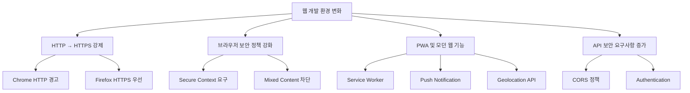
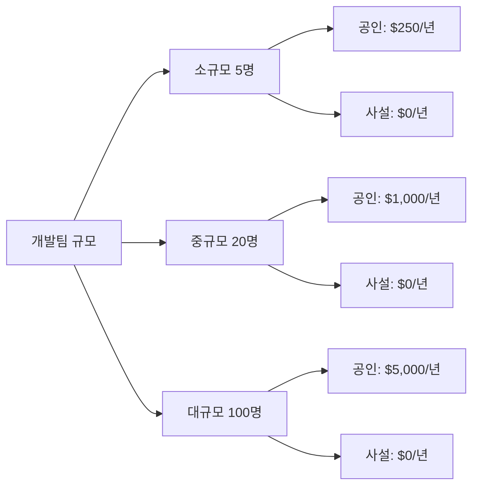
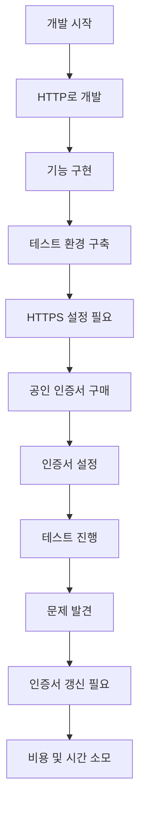
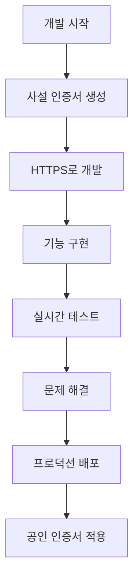
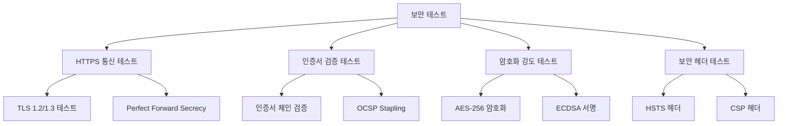
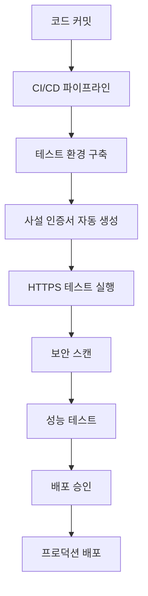
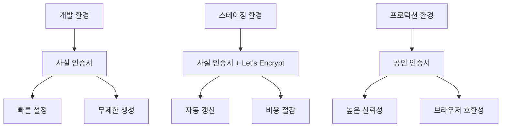
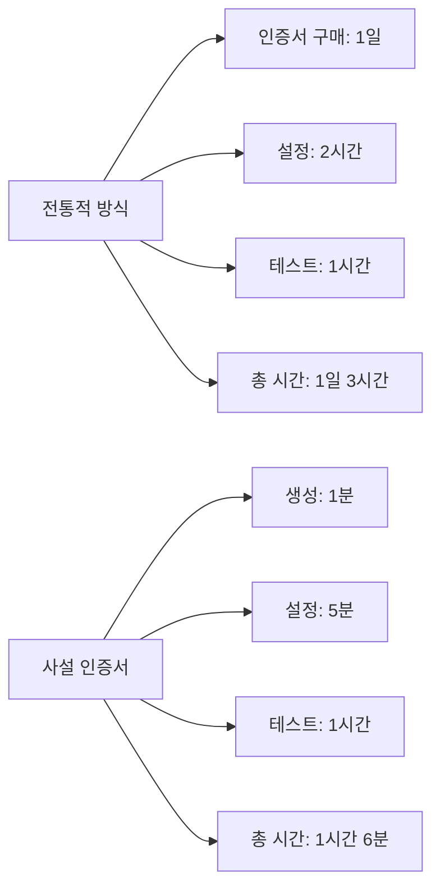

# 2. 사설 인증서가 필요한 이유

## 🎯 이 장에서 배울 내용

이 장에서는 사설 인증서가 왜 필요한지, 어떤 상황에서 사용하는지, 그리고 어떤 이점을 제공하는지에 대해 자세히 알아보겠습니다.

## 🚀 개발 환경에서의 필요성

### 현대 웹 개발의 변화

최근 웹 개발 환경에서는 다음과 같은 변화가 일어나고 있습니다:



### 개발자가 직면하는 문제들

#### 1. 브라우저 보안 정책
```javascript
// HTTP에서는 작동하지 않는 기능들
navigator.geolocation.getCurrentPosition()  // ❌ HTTP에서 차단
navigator.serviceWorker.register()         // ❌ HTTP에서 차단
new Notification('Hello')                  // ❌ HTTP에서 차단
```

#### 2. API 테스트의 어려움
```bash
# HTTPS가 필요한 API 테스트
curl -X POST https://api.example.com/webhook
# HTTP로는 CORS 에러 발생
curl -X POST http://api.example.com/webhook  # ❌ 차단됨
```

#### 3. 모바일 디바이스 테스트
- iOS Safari: HTTP에서 많은 기능 제한
- Android Chrome: HTTPS 우선 정책
- PWA 설치: HTTPS 필수

## 💰 비용 절감 효과

### 공인 인증서 vs 사설 인증서 비용 비교

| 인증서 유형 | 연간 비용 | 발급 시간 | 갱신 비용 |
|-------------|-----------|-----------|-----------|
| **공인 인증서** | $50 - $500 | 1-7일 | $50 - $500 |
| **사설 인증서** | 무료 | 즉시 | 무료 |

### 개발팀 규모별 비용 절감



## 🔧 개발 워크플로우 개선

### 전통적인 개발 과정의 문제점



### 사설 인증서를 사용한 개선된 워크플로우



## 🛡️ 보안 테스트 환경

### 보안 테스트의 필요성



### 사설 인증서를 사용한 보안 테스트

#### 1. 다양한 암호화 알고리즘 테스트
```bash
# 다양한 암호화 스위트 테스트
openssl s_client -cipher 'ECDHE-RSA-AES256-GCM-SHA384' -connect localhost:443
openssl s_client -cipher 'ECDHE-ECDSA-AES256-GCM-SHA384' -connect localhost:443
```

#### 2. 인증서 체인 테스트
```bash
# 인증서 체인 검증
openssl verify -CAfile ca.crt server.crt
```

#### 3. 보안 헤더 테스트
```bash
# 보안 헤더 확인
curl -I https://localhost:3000
# Strict-Transport-Security: max-age=31536000
# X-Content-Type-Options: nosniff
# X-Frame-Options: DENY
```

## 🚀 CI/CD 파이프라인 통합

### 자동화된 인증서 관리



### GitHub Actions 예시

```yaml
name: Security Testing
on: [push, pull_request]

jobs:
  security-test:
    runs-on: ubuntu-latest
    steps:
      - uses: actions/checkout@v2
      - name: Generate private certificate
        run: |
          openssl req -x509 -newkey rsa:4096 -keyout key.pem -out cert.pem -days 365 -nodes
      - name: Start HTTPS server
        run: |
          node server.js &
      - name: Run security tests
        run: |
          npm test -- --grep "HTTPS"
```

## 🌐 다양한 환경 지원

### 개발 환경별 요구사항

| 환경 | HTTPS 필요성 | 사설 인증서 적합성 |
|------|-------------|-------------------|
| **로컬 개발** | 높음 | ✅ 매우 적합 |
| **개발 서버** | 높음 | ✅ 매우 적합 |
| **스테이징** | 중간 | ⚠️ 조건부 |
| **프로덕션** | 필수 | ❌ 부적합 |

### 환경별 인증서 전략



## 🔍 실제 사용 사례

### 1. 웹 애플리케이션 개발
```javascript
// PWA 개발 시 HTTPS 필수
if ('serviceWorker' in navigator) {
  navigator.serviceWorker.register('/sw.js')
    .then(registration => console.log('SW registered'))
    .catch(error => console.log('SW registration failed'));
}
```

### 2. API 서버 개발
```python
# Flask HTTPS 서버 설정
from flask import Flask
import ssl

app = Flask(__name__)

if __name__ == '__main__':
    context = ssl.SSLContext(ssl.PROTOCOL_TLSv1_2)
    context.load_cert_chain('cert.pem', 'key.pem')
    app.run(host='0.0.0.0', port=443, ssl_context=context)
```

### 3. 마이크로서비스 아키텍처
```yaml
# Docker Compose에서 HTTPS 설정
version: '3.8'
services:
  api:
    image: nginx:alpine
    ports:
      - "443:443"
    volumes:
      - ./certs:/etc/nginx/certs
    environment:
      - SSL_CERT=/etc/nginx/certs/cert.pem
      - SSL_KEY=/etc/nginx/certs/key.pem
```

## 📊 성능 및 효율성

### 개발 생산성 향상



### 비용 효율성 분석

| 항목 | 공인 인증서 | 사설 인증서 | 절약 효과 |
|------|-------------|-------------|-----------|
| **초기 비용** | $100 | $0 | $100 |
| **갱신 비용** | $100/년 | $0 | $100/년 |
| **설정 시간** | 2시간 | 10분 | 1시간 50분 |
| **유지보수** | 복잡 | 간단 | 높음 |

## 🎯 다음 단계

이제 사설 인증서가 왜 필요한지 이해했으니, 다음 장에서는 OpenSSL을 사용하여 실제로 인증서를 생성하는 방법을 배워보겠습니다.

**다음: [3. OpenSSL을 이용한 인증서 발급](./03-openssl-certificates.md)**

---

## 💡 핵심 정리

- **개발 환경**에서 HTTPS 테스트를 위해 사설 인증서가 필수
- **비용 절감**: 공인 인증서 대비 무료
- **개발 생산성**: 즉시 생성 및 설정 가능
- **보안 테스트**: 다양한 보안 기능 테스트 가능
- **CI/CD 통합**: 자동화된 인증서 관리 가능
