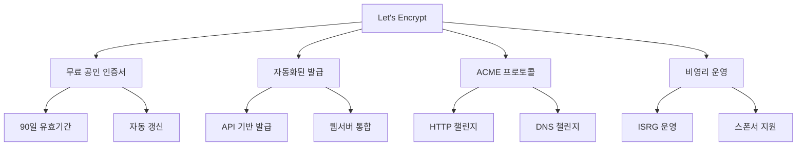
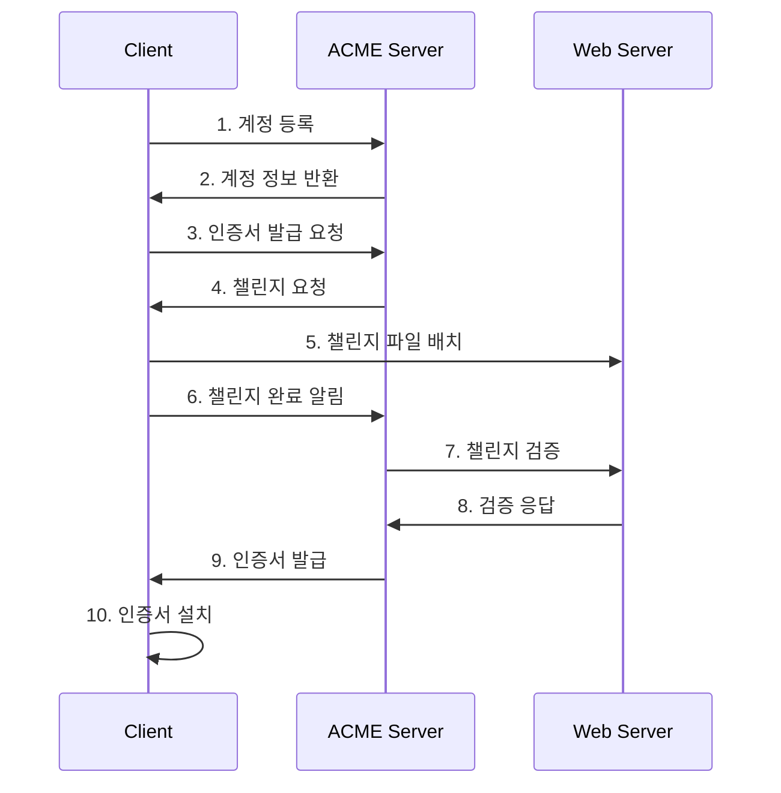

# Let's Encrypt 기초

## 🎯 이 장에서 배울 내용

이 장에서는 Let's Encrypt의 기본 개념부터 실제 사용까지 단계별로 학습합니다. 무료 공인 인증서의 혁신적인 접근 방식과 ACME 프로토콜의 동작 원리를 이해하고, 실제 프로덕션 환경에서 활용하는 방법을 배웁니다.

## 🚀 Let's Encrypt란 무엇인가?

### Let's Encrypt의 혁신

Let's Encrypt는 **무료로 공인 인증서를 제공하는 비영리 인증기관**입니다. 2015년에 설립되어 웹의 보안을 민주화하는 것을 목표로 합니다.



### 전통적인 인증서 vs Let's Encrypt

| 특징 | 전통적인 CA | Let's Encrypt |
|------|-------------|---------------|
| **비용** | 연간 수십만원 | 무료 |
| **발급 시간** | 수일~수주 | 수분 |
| **갱신** | 수동 | 자동 |
| **API** | 제한적 | 완전 자동화 |
| **유효기간** | 1-3년 | 90일 |
| **지원** | 전화/이메일 | 커뮤니티 |

## 🔧 ACME 프로토콜 이해

### ACME란?

ACME(Automated Certificate Management Environment)는 Let's Encrypt가 개발한 **자동화된 인증서 관리 프로토콜**입니다.



### 챌린지 방식

#### 1. HTTP-01 챌린지 (가장 일반적)
```bash
# Let's Encrypt가 요청하는 파일
http://example.com/.well-known/acme-challenge/TOKEN

# 파일 내용
TOKEN.ACCOUNT_KEY_THUMBPRINT
```

#### 2. DNS-01 챌린지 (고급)
```bash
# DNS TXT 레코드
_acme-challenge.example.com TXT "TOKEN"

# 와일드카드 인증서 발급 가능
*.example.com
```

## 📊 Rate Limit과 제한사항

### 주요 제한사항

| 제한 항목 | 제한량 | 기간 |
|-----------|--------|------|
| **도메인당 인증서** | 50개 | 주간 |
| **중복 인증서** | 5개 | 주간 |
| **계정당 IP** | 300개 | 3시간 |
| **새 계정** | 10개 | IP당 3시간 |

### 제한사항 이해

```bash
# 도메인 제한 예시
example.com          # ✅ 가능
*.example.com        # ✅ 가능 (DNS 챌린지 필요)
subdomain.example.com # ✅ 가능

# 제한 사항
localhost            # ❌ 불가능
192.168.1.1         # ❌ 불가능 (공인 IP만 가능)
internal.company.com # ❌ 불가능 (외부 접근 불가)
```

## 🛠️ 실제 사용 예시

### 1. 기본 certbot 사용

```bash
# certbot 설치 (Ubuntu/Debian)
sudo apt update
sudo apt install certbot python3-certbot-nginx

# Nginx와 함께 자동 설정
sudo certbot --nginx -d example.com -d www.example.com

# Apache와 함께 자동 설정
sudo certbot --apache -d example.com -d www.example.com
```

### 2. 수동 인증서 발급

```bash
# 인증서만 발급 (웹서버 설정은 수동)
sudo certbot certonly --webroot -w /var/www/html -d example.com

# DNS 챌린지 사용 (와일드카드 인증서)
sudo certbot certonly --manual --preferred-challenges dns -d *.example.com
```

### 3. 자동 갱신 설정

```bash
# 갱신 테스트
sudo certbot renew --dry-run

# 자동 갱신 설정 (crontab)
echo "0 12 * * * /usr/bin/certbot renew --quiet" | sudo crontab -
```

## 🔍 인증서 확인 및 관리

### 발급된 인증서 확인

```bash
# 발급된 인증서 목록
sudo certbot certificates

# 인증서 상세 정보
openssl x509 -in /etc/letsencrypt/live/example.com/cert.pem -text -noout

# 인증서 만료일 확인
openssl x509 -in /etc/letsencrypt/live/example.com/cert.pem -noout -dates
```

### 인증서 파일 구조

```
/etc/letsencrypt/live/example.com/
├── cert.pem          # 인증서 파일
├── chain.pem          # 중간 인증서 체인
├── fullchain.pem     # 전체 인증서 체인
└── privkey.pem       # 개인키 파일
```

## 🚨 주의사항 및 모범 사례

### 보안 고려사항

1. **개인키 보호**
```bash
# 개인키 권한 설정
sudo chmod 600 /etc/letsencrypt/live/example.com/privkey.pem
sudo chown root:root /etc/letsencrypt/live/example.com/privkey.pem
```

2. **백업 전략**
```bash
# 인증서 백업
sudo tar -czf letsencrypt-backup.tar.gz /etc/letsencrypt/
```

3. **모니터링 설정**
```bash
# 만료일 모니터링 스크립트
#!/bin/bash
DAYS_LEFT=$(openssl x509 -in /etc/letsencrypt/live/example.com/cert.pem -noout -dates | grep notAfter | cut -d= -f2 | xargs -I {} date -d {} +%s)
CURRENT_DATE=$(date +%s)
DAYS_DIFF=$(( ($DAYS_LEFT - $CURRENT_DATE) / 86400 ))

if [ $DAYS_DIFF -lt 30 ]; then
    echo "인증서가 $DAYS_DIFF일 후 만료됩니다!"
    # 알림 전송 로직
fi
```

### 모범 사례

1. **스테이징 환경 사용**
```bash
# 테스트용 인증서 발급
sudo certbot --staging -d example.com
```

2. **자동 갱신 검증**
```bash
# 갱신 후 웹서버 재시작
sudo certbot renew --post-hook "systemctl reload nginx"
```

3. **다중 도메인 관리**
```bash
# 여러 도메인을 한 번에 관리
sudo certbot --nginx -d example.com -d www.example.com -d api.example.com
```

## 🔄 문제 해결

### 일반적인 문제들

#### 1. Rate Limit 초과
```bash
# 해결 방법: 시간을 두고 재시도
# 또는 스테이징 환경에서 테스트
sudo certbot --staging -d example.com
```

#### 2. 도메인 소유권 검증 실패
```bash
# 해결 방법: DNS 설정 확인
nslookup example.com
dig example.com
```

#### 3. 웹서버 설정 오류
```bash
# 해결 방법: 웹서버 설정 확인
sudo nginx -t
sudo apache2ctl configtest
```

## 📚 다음 단계

Let's Encrypt 기초를 완료했다면 다음 단계로 진행하세요:

- **[certbot 자동화](./02-certbot-automation.md)** - 고급 자동화 기법
- **[Kubernetes cert-manager](./03-kubernetes-cert-manager.md)** - 컨테이너 환경 관리
- **[클라우드 제공업체](./04-cloud-providers.md)** - 클라우드 네이티브 솔루션

## 💡 핵심 정리

- **Let's Encrypt**는 무료 공인 인증서를 제공하는 혁신적인 CA
- **ACME 프로토콜**을 통해 완전 자동화된 인증서 관리 가능
- **Rate Limit**을 고려한 신중한 계획 필요
- **자동 갱신**과 **모니터링**이 운영의 핵심
- **보안**과 **백업** 전략을 반드시 수립해야 함

---

**다음: [certbot 자동화](./02-certbot-automation.md)**
