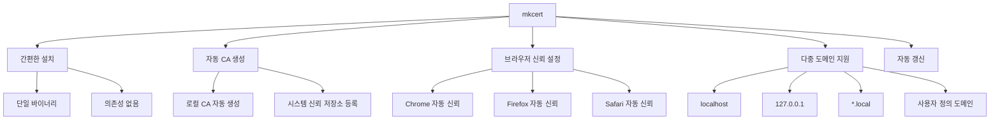
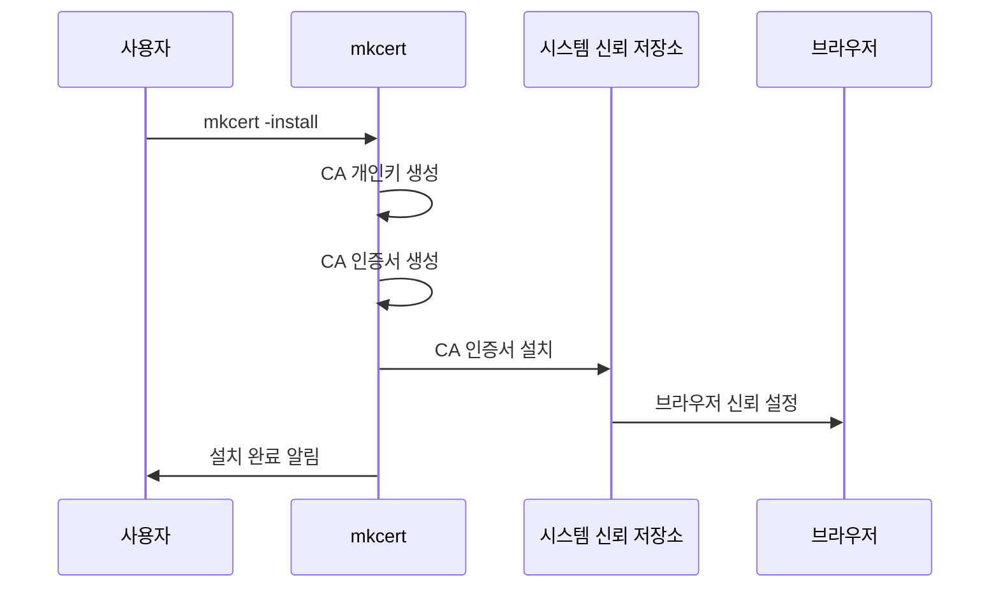
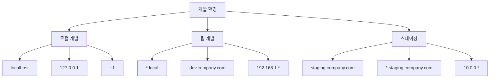

# 4. mkcert를 이용한 간편 인증서 발급

## 🎯 이 장에서 배울 내용

이 장에서는 OpenSSL보다 훨씬 간편한 mkcert 도구를 사용하여 사설 인증서를 생성하고 관리하는 방법을 학습합니다. mkcert는 개발자 친화적인 도구로, 복잡한 설정 없이도 브라우저에서 신뢰되는 인증서를 생성할 수 있습니다.

## 🚀 mkcert란 무엇인가?

### mkcert의 특징



### OpenSSL vs mkcert 비교

| 특징 | OpenSSL | mkcert |
|------|---------|--------|
| **설치 복잡도** | 복잡 | 간단 |
| **설정 파일** | 필요 | 불필요 |
| **브라우저 신뢰** | 수동 설정 | 자동 설정 |
| **다중 도메인** | 복잡 | 간단 |
| **자동 갱신** | 수동 | 자동 |
| **학습 곡선** | 가파름 | 완만 |

## 📦 mkcert 설치

### macOS에서 설치
```bash
# Homebrew 사용
brew install mkcert

# 또는 MacPorts 사용
sudo port install mkcert
```

### Linux에서 설치

#### Ubuntu/Debian
```bash
# 1단계: 의존성 설치
sudo apt install libnss3-tools

# 2단계: mkcert 바이너리 다운로드 및 설치
wget -O mkcert https://github.com/FiloSottile/mkcert/releases/download/v1.4.4/mkcert-v1.4.4-linux-amd64
chmod +x mkcert
sudo mv mkcert /usr/local/bin/
```

#### CentOS/RHEL/Fedora
```bash
# 1단계: 의존성 설치
sudo yum install nss-tools
# 또는
sudo dnf install nss-tools

# 2단계: mkcert 바이너리 다운로드 및 설치
wget -O mkcert https://github.com/FiloSottile/mkcert/releases/download/v1.4.4/mkcert-v1.4.4-linux-amd64
chmod +x mkcert
sudo mv mkcert /usr/local/bin/
```

### 설치 확인
```bash
mkcert -version
# v1.4.4
```

## 🔧 mkcert 초기 설정

### 1단계: 로컬 CA 설치
```bash
# 로컬 CA 생성 및 시스템에 설치
mkcert -install
```

### 설치 과정 설명



### 2단계: CA 인증서 위치 확인
```bash
# CA 인증서 위치 확인
mkcert -CAROOT
# macOS: /Users/사용자명/Library/Application Support/mkcert
# Linux: /home/사용자명/.local/share/mkcert
```

### 3단계: CA 인증서 파일 확인
```bash
# CA 인증서 파일들 확인
ls -la $(mkcert -CAROOT)
# rootCA.pem (CA 인증서)
# rootCA-key.pem (CA 개인키)
```

## 🖥️ 서버 인증서 생성

### 기본 localhost 인증서 생성
```bash
# localhost용 인증서 생성
mkcert localhost

# 생성된 파일들
# localhost.pem (인증서)
# localhost-key.pem (개인키)
```

### 다중 도메인 인증서 생성
```bash
# 여러 도메인을 포함한 인증서 생성
mkcert localhost 127.0.0.1 ::1 example.com *.example.com

# 생성된 파일들
# localhost+3.pem (인증서)
# localhost+3-key.pem (개인키)
```

### IP 주소 포함 인증서 생성
```bash
# IP 주소와 도메인을 모두 포함
mkcert localhost 127.0.0.1 192.168.1.100 ::1

# 생성된 파일들
# localhost+3.pem (인증서)
# localhost+3-key.pem (개인키)
```

## 🌐 다양한 환경별 인증서 생성

### 개발 환경별 설정



### 1. 로컬 개발 환경
```bash
# 기본 로컬 개발용
mkcert localhost 127.0.0.1 ::1

# 추가 IP 주소 포함
mkcert localhost 127.0.0.1 ::1 192.168.1.100
```

### 2. 팀 개발 환경
```bash
# 팀 내부 도메인
mkcert localhost 127.0.0.1 ::1 *.local dev.company.com *.dev.company.com

# 내부 IP 대역
mkcert localhost 127.0.0.1 ::1 192.168.1.100 192.168.1.101
```

### 3. 스테이징 환경
```bash
# 스테이징 서버용
mkcert staging.company.com *.staging.company.com 10.0.0.100
```

## 🔧 실제 프로젝트 적용

### Node.js Express 서버
```javascript
// server.js
const express = require('express');
const https = require('https');
const fs = require('fs');

const app = express();

// HTTPS 서버 설정
const options = {
  key: fs.readFileSync('localhost-key.pem'),
  cert: fs.readFileSync('localhost.pem')
};

app.get('/', (req, res) => {
  res.send('Hello HTTPS World!');
});

https.createServer(options, app).listen(443, () => {
  console.log('HTTPS Server running on https://localhost');
});
```

### Python Flask 서버
```python
# app.py
from flask import Flask
import ssl

app = Flask(__name__)

@app.route('/')
def hello():
    return 'Hello HTTPS World!'

if __name__ == '__main__':
    context = ssl.SSLContext(ssl.PROTOCOL_TLSv1_2)
    context.load_cert_chain('localhost.pem', 'localhost-key.pem')
    app.run(host='0.0.0.0', port=443, ssl_context=context)
```

### Nginx 설정
```nginx
# nginx.conf
server {
    listen 443 ssl;
    server_name localhost;
    
    ssl_certificate /path/to/localhost.pem;
    ssl_certificate_key /path/to/localhost-key.pem;
    
    location / {
        proxy_pass http://localhost:3000;
        proxy_set_header Host $host;
        proxy_set_header X-Real-IP $remote_addr;
    }
}
```

### Apache 설정
```apache
# httpd.conf
<VirtualHost *:443>
    ServerName localhost
    DocumentRoot /var/www/html
    
    SSLEngine on
    SSLCertificateFile /path/to/localhost.pem
    SSLCertificateKeyFile /path/to/localhost-key.pem
</VirtualHost>
```

## 🐳 Docker 환경에서 사용

### Dockerfile 예시
```dockerfile
# Dockerfile
FROM node:18-alpine

# mkcert 설치
RUN apk add --no-cache openssl
COPY mkcert /usr/local/bin/
RUN chmod +x /usr/local/bin/mkcert

WORKDIR /app
COPY package*.json ./
RUN npm install

COPY . .

# 인증서 생성
RUN mkcert -install
RUN mkcert localhost 127.0.0.1

EXPOSE 443
CMD ["npm", "start"]
```

### Docker Compose 예시
```yaml
# docker-compose.yml
version: '3.8'
services:
  web:
    build: .
    ports:
      - "443:443"
    volumes:
      - ./certs:/app/certs
    environment:
      - SSL_CERT=/app/certs/localhost.pem
      - SSL_KEY=/app/certs/localhost-key.pem
```

## 🔄 인증서 관리 및 갱신

### 인증서 정보 확인
```bash
# 인증서 상세 정보 확인
openssl x509 -in localhost.pem -text -noout

# 인증서 유효기간 확인
openssl x509 -in localhost.pem -noout -dates

# 인증서 주체 정보 확인
openssl x509 -in localhost.pem -noout -subject
```

### 인증서 갱신
```bash
# 기존 인증서 백업
cp localhost.pem localhost.pem.backup
cp localhost-key.pem localhost-key.pem.backup

# 새 인증서 생성
mkcert localhost 127.0.0.1 ::1

# 서버 재시작
# (애플리케이션에 따라 다름)
```

### 자동 갱신 스크립트
```bash
#!/bin/bash
# renew-cert.sh

CERT_FILE="localhost.pem"
KEY_FILE="localhost-key.pem"
BACKUP_DIR="backup"

# 백업 디렉토리 생성
mkdir -p $BACKUP_DIR

# 기존 인증서 백업
if [ -f "$CERT_FILE" ]; then
    cp $CERT_FILE $BACKUP_DIR/$(date +%Y%m%d_%H%M%S)_$CERT_FILE
    cp $KEY_FILE $BACKUP_DIR/$(date +%Y%m%d_%H%M%S)_$KEY_FILE
fi

# 새 인증서 생성
mkcert localhost 127.0.0.1 ::1

echo "인증서가 갱신되었습니다."
echo "서버를 재시작해주세요."
```

## 🧪 인증서 테스트

### 브라우저 테스트
```bash
# HTTPS 서버 시작
python -m http.server 443 --bind 0.0.0.0

# 브라우저에서 접속
# https://localhost
# https://127.0.0.1
```

### 명령줄 테스트
```bash
# OpenSSL로 테스트
openssl s_client -connect localhost:443 -servername localhost

# curl로 테스트
curl -k https://localhost
curl -v https://localhost
```

### 인증서 검증
```bash
# 인증서 체인 검증
openssl verify -CAfile $(mkcert -CAROOT)/rootCA.pem localhost.pem

# 인증서 정보 출력
openssl x509 -in localhost.pem -text -noout | grep -A 5 "Subject Alternative Name"
```

## 🔍 문제 해결

### 일반적인 문제와 해결 방법

#### 1. "mkcert: command not found" 오류
```bash
# 해결 방법: PATH 확인 및 설정
echo $PATH
export PATH=$PATH:/usr/local/bin
# 또는
which mkcert
```

#### 2. "unable to install CA" 오류
```bash
# 해결 방법: 관리자 권한으로 실행
sudo mkcert -install
```

#### 3. "certificate verify failed" 오류
```bash
# 해결 방법: CA 재설치
mkcert -uninstall
mkcert -install
```

#### 4. 브라우저에서 여전히 경고가 나타나는 경우
```bash
# 해결 방법: 브라우저 캐시 클리어
# Chrome: chrome://settings/certificates
# Firefox: about:preferences#privacy
# Safari: 키체인 접근 앱에서 확인
```

## 📚 다음 단계

이제 mkcert를 사용하여 간편하게 인증서를 생성하는 방법을 배웠습니다. 다음 장에서는 실제 프로젝트에 이러한 인증서를 적용하는 방법을 알아보겠습니다.

**다음: [5. 실제 프로젝트 적용](./05-practical-application.md)**

---

## 💡 핵심 정리

- **mkcert**는 OpenSSL보다 훨씬 간편한 인증서 생성 도구
- **자동 CA 설치**로 브라우저 신뢰 설정 자동화
- **다중 도메인 지원**으로 다양한 개발 환경 대응
- **Docker 통합**으로 컨테이너 환경에서도 사용 가능
- **자동 갱신**으로 인증서 관리 부담 최소화
