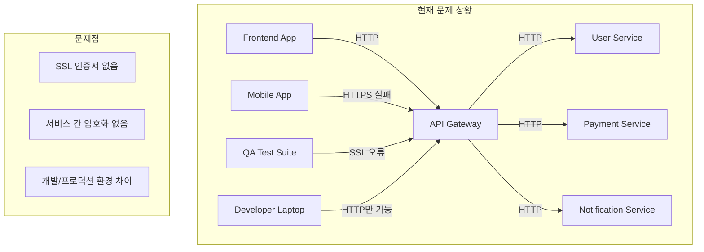

# 8. 실제 시나리오 기반 실습

## 🎯 이 장에서 배울 내용

이 장에서는 실제 개발 환경에서 발생하는 구체적인 문제 상황을 바탕으로 사설 인증서를 활용한 해결 방법을 단계별로 실습합니다. 이론적 지식이 아닌 실제로 마주칠 수 있는 현실적인 시나리오를 통해 사설 인증서의 필요성과 활용법을 깊이 있게 이해할 수 있습니다.

## 🏢 실제 시나리오: 스타트업의 급성장 통신 보안 문제

### 📋 상황 배경

**회사**: 핀테크 스타트업 "SecurePay" (직원 15명)  
**서비스**: 모바일 결제 솔루션  
**현재 상황**: 시리즈 A 투자 유치 후 급격한 사용자 증가  
**핵심 문제**: 개발팀의 보안 인프라 부족으로 인한 서비스 안정성 위험

### 🚨 발생한 구체적인 문제들

#### 1. 개발 환경의 보안 허점
```bash
# 현재 상황: 개발자들이 HTTP로만 테스트
curl http://api-dev.securepay.com/users
# 결과: 브라우저에서 "Not Secure" 경고
# 문제: 실제 프로덕션과 다른 환경으로 인한 버그 발생
```

#### 2. 마이크로서비스 간 통신 보안 부재
```javascript
// 현재 코드: 서비스 간 HTTP 통신
const userService = await fetch('http://user-service:3001/api/users');
const paymentService = await fetch('http://payment-service:3002/api/process');

// 문제점:
// - 네트워크 스니핑 가능
// - 중간자 공격 취약
// - 로그에서 민감 정보 노출
```

#### 3. 모바일 앱 개발의 어려움
```swift
// iOS 앱에서 발생하는 문제
let url = URL(string: "https://api-dev.securepay.com")!
// 결과: SSL certificate verification failed
// 문제: 개발 서버의 자체 서명 인증서로 인한 연결 실패
```

#### 4. QA 팀의 테스트 환경 문제
```bash
# QA 팀이 겪는 문제
# - 브라우저에서 계속 "Not Secure" 경고
# - 자동화 테스트에서 SSL 오류 발생
# - 모바일 디바이스에서 앱 연결 실패
```

### 💰 비즈니스 임팩트

| 문제 | 비즈니스 영향 | 예상 손실 |
|------|---------------|-----------|
| **개발 지연** | 기능 개발 속도 저하 | 월 2억원 |
| **보안 취약점** | 해킹 위험 증가 | 브랜드 신뢰도 하락 |
| **QA 효율성** | 테스트 시간 증가 | 릴리스 지연 |
| **모바일 앱** | 사용자 이탈 | 일일 활성 사용자 30% 감소 |

### 🎯 해결 목표

1. **개발 환경 보안 강화**: 모든 개발 서비스에 HTTPS 적용
2. **마이크로서비스 보안**: 서비스 간 통신 암호화
3. **모바일 앱 호환성**: 개발 서버와의 안전한 통신
4. **QA 효율성**: 자동화 테스트 환경 개선
5. **비용 절감**: 공인 인증서 구매 비용 절약 (월 500만원)

## 🔧 단계별 해결 과정

### 1단계: 현재 상황 분석 및 요구사항 정의

#### 현재 아키텍처 분석


#### 요구사항 정의
```yaml
보안 요구사항:
  - 모든 API 엔드포인트 HTTPS 적용
  - 마이크로서비스 간 TLS 통신
  - 모바일 앱 호환 인증서
  - 개발자별 독립적인 테스트 환경

기술 요구사항:
  - Docker 컨테이너 환경 지원
  - CI/CD 파이프라인 통합
  - 자동화 테스트 호환
  - 로컬 개발 환경 지원

비즈니스 요구사항:
  - 최소 비용으로 구현
  - 빠른 배포 가능
  - 유지보수 용이성
  - 확장 가능한 구조
```

### 2단계: 사설 인증서 기반 보안 인프라 구축

#### Root CA 생성 및 배포
```bash
#!/bin/bash
# setup-ca.sh - 회사 전체 CA 설정

echo "🏢 SecurePay 개발 환경 CA 설정 시작..."

# 1. CA 디렉토리 구조 생성
mkdir -p ca/{certs,private,crl,newcerts}
mkdir -p services/{api-gateway,user-service,payment-service,notification-service}

# 2. Root CA 생성 (10년 유효)
openssl genrsa -out ca/private/securepay-root-ca.key 4096
openssl req -new -x509 -days 3650 -key ca/private/securepay-root-ca.key \
    -out ca/certs/securepay-root-ca.crt \
    -subj "/C=KR/ST=Seoul/L=Seoul/O=SecurePay/OU=IT/CN=SecurePay Root CA"

# 3. CA 설정 파일 생성
cat > ca/ca.conf << 'EOF'
[ ca ]
default_ca = CA_default

[ CA_default ]
dir = ./ca
certs = $dir/certs
crl_dir = $dir/crl
new_certs_dir = $dir/newcerts
database = $dir/index.txt
serial = $dir/serial
RANDFILE = $dir/.rand

private_key = $dir/private/securepay-root-ca.key
certificate = $dir/certs/securepay-root-ca.crt

crlnumber = $dir/crlnumber
crl = $dir/crl/securepay-root-ca.crl
crl_extensions = crl_ext
default_crl_days = 30

default_md = sha256
name_opt = ca_default
cert_opt = ca_default
default_days = 365
preserve = no
policy = policy_strict

[ policy_strict ]
countryName = match
stateOrProvinceName = match
organizationName = match
organizationalUnitName = optional
commonName = supplied
emailAddress = optional

[ req ]
default_bits = 4096
distinguished_name = req_distinguished_name
string_mask = utf8only
default_md = sha256
x509_extensions = v3_ca

[ req_distinguished_name ]
countryName = Country Name (2 letter code)
stateOrProvinceName = State or Province Name
localityName = Locality Name
0.organizationName = Organization Name
organizationalUnitName = Organizational Unit Name
commonName = Common Name
emailAddress = Email Address

[ v3_ca ]
subjectKeyIdentifier = hash
authorityKeyIdentifier = keyid:always,issuer
basicConstraints = critical, CA:true
keyUsage = critical, digitalSignature, cRLSign, keyCertSign

[ v3_intermediate_ca ]
subjectKeyIdentifier = hash
authorityKeyIdentifier = keyid:always,issuer
basicConstraints = critical, CA:true, pathlen:0
keyUsage = critical, digitalSignature, cRLSign, keyCertSign

[ usr_cert ]
basicConstraints = CA:FALSE
nsCertType = client, email
nsComment = "OpenSSL Generated Client Certificate"
subjectKeyIdentifier = hash
authorityKeyIdentifier = keyid,issuer
keyUsage = critical, nonRepudiation, digitalSignature, keyEncipherment
extendedKeyUsage = clientAuth, emailProtection

[ server_cert ]
basicConstraints = CA:FALSE
nsCertType = server
nsComment = "OpenSSL Generated Server Certificate"
subjectKeyIdentifier = hash
authorityKeyIdentifier = keyid,issuer:always
keyUsage = critical, digitalSignature, keyEncipherment
extendedKeyUsage = serverAuth

[ crl_ext ]
authorityKeyIdentifier = keyid:always
EOF

# 4. CA 데이터베이스 초기화
touch ca/index.txt
echo 1000 > ca/serial
echo 1000 > ca/crlnumber

echo "✅ SecurePay Root CA 설정 완료"
echo "📁 CA 인증서: ca/certs/securepay-root-ca.crt"
echo "🔑 CA 개인키: ca/private/securepay-root-ca.key"
```

#### 개발자 워크스테이션 설정
```bash
#!/bin/bash
# setup-dev-workstation.sh - 개발자 개별 환경 설정

echo "👨‍💻 개발자 워크스테이션 설정 시작..."

# 1. CA 인증서를 시스템 신뢰 저장소에 추가
echo "🔐 CA 인증서를 시스템에 설치 중..."

# macOS
if [[ "$OSTYPE" == "darwin"* ]]; then
    sudo security add-trusted-cert -d -r trustRoot -k /Library/Keychains/System.keychain ca/certs/securepay-root-ca.crt
    echo "✅ macOS 신뢰 저장소에 CA 인증서 추가 완료"
fi

# Linux
if [[ "$OSTYPE" == "linux-gnu"* ]]; then
    sudo cp ca/certs/securepay-root-ca.crt /usr/local/share/ca-certificates/securepay-root-ca.crt
    sudo update-ca-certificates
    echo "✅ Linux 신뢰 저장소에 CA 인증서 추가 완료"
fi

# 2. 개발자별 개인 인증서 생성
DEVELOPER_NAME=${1:-"developer"}
echo "👤 개발자 인증서 생성: $DEVELOPER_NAME"

# 개발자 개인키 생성
openssl genrsa -out "certs/${DEVELOPER_NAME}-key.pem" 4096

# 개발자 CSR 생성
openssl req -new -key "certs/${DEVELOPER_NAME}-key.pem" \
    -out "certs/${DEVELOPER_NAME}.csr" \
    -subj "/C=KR/ST=Seoul/L=Seoul/O=SecurePay/OU=Development/CN=${DEVELOPER_NAME}.securepay.local"

# 개발자 인증서 서명
openssl ca -config ca/ca.conf -extensions usr_cert -days 365 \
    -notext -md sha256 -in "certs/${DEVELOPER_NAME}.csr" \
    -out "certs/${DEVELOPER_NAME}-cert.pem"

echo "✅ 개발자 인증서 생성 완료"
echo "📁 인증서: certs/${DEVELOPER_NAME}-cert.pem"
echo "🔑 개인키: certs/${DEVELOPER_NAME}-key.pem"
```

### 3단계: 마이크로서비스 보안 통신 구현

#### API Gateway HTTPS 설정
```nginx
# nginx.conf - API Gateway 설정
upstream user_service {
    server user-service:3001;
}

upstream payment_service {
    server payment-service:3002;
}

upstream notification_service {
    server notification-service:3003;
}

server {
    listen 443 ssl http2;
    server_name api-dev.securepay.local *.securepay.local;
    
    # SSL 인증서 설정
    ssl_certificate /etc/ssl/certs/api-gateway-cert.pem;
    ssl_certificate_key /etc/ssl/private/api-gateway-key.pem;
    
    # SSL 보안 설정
    ssl_protocols TLSv1.2 TLSv1.3;
    ssl_ciphers ECDHE-RSA-AES256-GCM-SHA512:DHE-RSA-AES256-GCM-SHA512:ECDHE-RSA-AES256-GCM-SHA384:DHE-RSA-AES256-GCM-SHA384;
    ssl_prefer_server_ciphers off;
    ssl_session_cache shared:SSL:10m;
    ssl_session_timeout 10m;
    
    # 클라이언트 인증서 검증 (선택적)
    ssl_client_certificate /etc/ssl/certs/securepay-root-ca.crt;
    ssl_verify_client optional;
    
    # API 라우팅
    location /api/users {
        proxy_pass https://user_service;
        proxy_ssl_certificate /etc/ssl/certs/api-gateway-cert.pem;
        proxy_ssl_certificate_key /etc/ssl/private/api-gateway-key.pem;
        proxy_ssl_trusted_certificate /etc/ssl/certs/securepay-root-ca.crt;
        proxy_ssl_verify on;
        proxy_ssl_verify_depth 2;
    }
    
    location /api/payments {
        proxy_pass https://payment_service;
        proxy_ssl_certificate /etc/ssl/certs/api-gateway-cert.pem;
        proxy_ssl_certificate_key /etc/ssl/private/api-gateway-key.pem;
        proxy_ssl_trusted_certificate /etc/ssl/certs/securepay-root-ca.crt;
        proxy_ssl_verify on;
        proxy_ssl_verify_depth 2;
    }
    
    location /api/notifications {
        proxy_pass https://notification_service;
        proxy_ssl_certificate /etc/ssl/certs/api-gateway-cert.pem;
        proxy_ssl_certificate_key /etc/ssl/private/api-gateway-key.pem;
        proxy_ssl_trusted_certificate /etc/ssl/certs/securepay-root-ca.crt;
        proxy_ssl_verify on;
        proxy_ssl_verify_depth 2;
    }
}
```

#### User Service Node.js 구현
```javascript
// user-service/server.js
const express = require('express');
const https = require('https');
const fs = require('fs');
const cors = require('cors');

const app = express();
app.use(cors());
app.use(express.json());

// SSL 옵션 설정
const sslOptions = {
    key: fs.readFileSync('/etc/ssl/private/user-service-key.pem'),
    cert: fs.readFileSync('/etc/ssl/certs/user-service-cert.pem'),
    ca: fs.readFileSync('/etc/ssl/certs/securepay-root-ca.crt'),
    requestCert: true,  // 클라이언트 인증서 요구
    rejectUnauthorized: true  // 신뢰할 수 없는 인증서 거부
};

// 사용자 데이터 (실제로는 데이터베이스 사용)
const users = [
    { id: 1, name: '김철수', email: 'kim@securepay.com', balance: 1000000 },
    { id: 2, name: '이영희', email: 'lee@securepay.com', balance: 500000 },
    { id: 3, name: '박민수', email: 'park@securepay.com', balance: 2000000 }
];

// API 엔드포인트
app.get('/api/users', (req, res) => {
    console.log('🔐 클라이언트 인증서 정보:', req.socket.getPeerCertificate());
    res.json(users);
});

app.get('/api/users/:id', (req, res) => {
    const user = users.find(u => u.id === parseInt(req.params.id));
    if (!user) {
        return res.status(404).json({ error: '사용자를 찾을 수 없습니다' });
    }
    res.json(user);
});

app.post('/api/users/:id/balance', (req, res) => {
    const userId = parseInt(req.params.id);
    const { amount } = req.body;
    
    const user = users.find(u => u.id === userId);
    if (!user) {
        return res.status(404).json({ error: '사용자를 찾을 수 없습니다' });
    }
    
    user.balance += amount;
    console.log(`💰 사용자 ${user.name}의 잔액이 ${amount}원 변경됨`);
    
    res.json({ 
        message: '잔액이 성공적으로 업데이트되었습니다',
        newBalance: user.balance 
    });
});

// HTTPS 서버 시작
const server = https.createServer(sslOptions, app);
server.listen(3001, '0.0.0.0', () => {
    console.log('🔐 User Service가 HTTPS로 실행 중입니다 (포트: 3001)');
    console.log('📋 사용 가능한 엔드포인트:');
    console.log('  - GET /api/users - 모든 사용자 조회');
    console.log('  - GET /api/users/:id - 특정 사용자 조회');
    console.log('  - POST /api/users/:id/balance - 잔액 업데이트');
});

// 서비스 간 통신을 위한 클라이언트 설정
const paymentServiceClient = https.createAgent({
    key: fs.readFileSync('/etc/ssl/private/user-service-key.pem'),
    cert: fs.readFileSync('/etc/ssl/certs/user-service-cert.pem'),
    ca: fs.readFileSync('/etc/ssl/certs/securepay-root-ca.crt'),
    rejectUnauthorized: true
});

// Payment Service와의 통신 예시
app.post('/api/users/:id/transfer', async (req, res) => {
    const userId = parseInt(req.params.id);
    const { targetUserId, amount } = req.body;
    
    try {
        // Payment Service에 결제 요청
        const paymentResponse = await fetch('https://payment-service:3002/api/process', {
            method: 'POST',
            headers: { 'Content-Type': 'application/json' },
            body: JSON.stringify({ fromUserId: userId, toUserId: targetUserId, amount }),
            agent: paymentServiceClient
        });
        
        const paymentResult = await paymentResponse.json();
        
        if (paymentResult.success) {
            // 잔액 업데이트
            const user = users.find(u => u.id === userId);
            const targetUser = users.find(u => u.id === targetUserId);
            
            user.balance -= amount;
            targetUser.balance += amount;
            
            res.json({ 
                message: '송금이 성공적으로 완료되었습니다',
                transactionId: paymentResult.transactionId 
            });
        } else {
            res.status(400).json({ error: '송금 처리 중 오류가 발생했습니다' });
        }
    } catch (error) {
        console.error('송금 처리 오류:', error);
        res.status(500).json({ error: '서버 오류가 발생했습니다' });
    }
});
```

### 4단계: Docker 환경 통합

#### Docker Compose 설정
```yaml
# docker-compose.yml
version: '3.8'

services:
  # CA 및 인증서 관리 서비스
  ca-manager:
    build: ./ca-manager
    volumes:
      - ./ca:/app/ca
      - ./certs:/app/certs
    networks:
      - securepay-network

  # API Gateway
  api-gateway:
    image: nginx:alpine
    ports:
      - "443:443"
    volumes:
      - ./nginx.conf:/etc/nginx/nginx.conf:ro
      - ./certs/api-gateway-cert.pem:/etc/ssl/certs/api-gateway-cert.pem:ro
      - ./certs/api-gateway-key.pem:/etc/ssl/private/api-gateway-key.pem:ro
      - ./ca/certs/securepay-root-ca.crt:/etc/ssl/certs/securepay-root-ca.crt:ro
    depends_on:
      - user-service
      - payment-service
      - notification-service
    networks:
      - securepay-network

  # User Service
  user-service:
    build: ./user-service
    volumes:
      - ./certs/user-service-cert.pem:/etc/ssl/certs/user-service-cert.pem:ro
      - ./certs/user-service-key.pem:/etc/ssl/private/user-service-key.pem:ro
      - ./ca/certs/securepay-root-ca.crt:/etc/ssl/certs/securepay-root-ca.crt:ro
    environment:
      - NODE_ENV=development
      - SSL_CERT_PATH=/etc/ssl/certs/user-service-cert.pem
      - SSL_KEY_PATH=/etc/ssl/private/user-service-key.pem
      - CA_CERT_PATH=/etc/ssl/certs/securepay-root-ca.crt
    networks:
      - securepay-network

  # Payment Service
  payment-service:
    build: ./payment-service
    volumes:
      - ./certs/payment-service-cert.pem:/etc/ssl/certs/payment-service-cert.pem:ro
      - ./certs/payment-service-key.pem:/etc/ssl/private/payment-service-key.pem:ro
      - ./ca/certs/securepay-root-ca.crt:/etc/ssl/certs/securepay-root-ca.crt:ro
    environment:
      - NODE_ENV=development
      - SSL_CERT_PATH=/etc/ssl/certs/payment-service-cert.pem
      - SSL_KEY_PATH=/etc/ssl/private/payment-service-key.pem
      - CA_CERT_PATH=/etc/ssl/certs/securepay-root-ca.crt
    networks:
      - securepay-network

  # Notification Service
  notification-service:
    build: ./notification-service
    volumes:
      - ./certs/notification-service-cert.pem:/etc/ssl/certs/notification-service-cert.pem:ro
      - ./certs/notification-service-key.pem:/etc/ssl/private/notification-service-key.pem:ro
      - ./ca/certs/securepay-root-ca.crt:/etc/ssl/certs/securepay-root-ca.crt:ro
    environment:
      - NODE_ENV=development
      - SSL_CERT_PATH=/etc/ssl/certs/notification-service-cert.pem
      - SSL_KEY_PATH=/etc/ssl/private/notification-service-key.pem
      - CA_CERT_PATH=/etc/ssl/certs/securepay-root-ca.crt
    networks:
      - securepay-network

  # 개발용 데이터베이스
  postgres:
    image: postgres:13
    environment:
      - POSTGRES_DB=securepay_dev
      - POSTGRES_USER=securepay
      - POSTGRES_PASSWORD=dev_password_123
    volumes:
      - postgres_data:/var/lib/postgresql/data
    networks:
      - securepay-network

networks:
  securepay-network:
    driver: bridge

volumes:
  postgres_data:
```

#### 자동화된 인증서 생성 스크립트
```bash
#!/bin/bash
# generate-service-certs.sh - 서비스별 인증서 자동 생성

SERVICES=("api-gateway" "user-service" "payment-service" "notification-service")

echo "🔐 SecurePay 서비스 인증서 생성 시작..."

for service in "${SERVICES[@]}"; do
    echo "📋 $service 인증서 생성 중..."
    
    # 서비스별 개인키 생성
    openssl genrsa -out "certs/${service}-key.pem" 4096
    
    # 서비스별 CSR 생성
    openssl req -new -key "certs/${service}-key.pem" \
        -out "certs/${service}.csr" \
        -subj "/C=KR/ST=Seoul/L=Seoul/O=SecurePay/OU=Services/CN=${service}.securepay.local"
    
    # 서비스별 인증서 서명
    openssl ca -config ca/ca.conf -extensions server_cert -days 365 \
        -notext -md sha256 -in "certs/${service}.csr" \
        -out "certs/${service}-cert.pem"
    
    echo "✅ $service 인증서 생성 완료"
done

echo "🎉 모든 서비스 인증서 생성 완료!"
echo ""
echo "📁 생성된 파일들:"
for service in "${SERVICES[@]}"; do
    echo "  - $service 인증서: certs/${service}-cert.pem"
    echo "  - $service 개인키: certs/${service}-key.pem"
done
```

### 5단계: 모바일 앱 개발 환경 통합

#### iOS 앱 네트워킹 설정
```swift
// NetworkManager.swift
import Foundation
import Network

class SecurePayNetworkManager {
    private let session: URLSession
    
    init() {
        // 개발 환경용 SSL 설정
        let config = URLSessionConfiguration.default
        
        // 개발 서버 인증서 검증 설정
        config.urlSessionDelegate = self
        
        self.session = URLSession(configuration: config)
    }
    
    func fetchUsers() async throws -> [User] {
        let url = URL(string: "https://api-dev.securepay.local/api/users")!
        
        let (data, response) = try await session.data(from: url)
        
        guard let httpResponse = response as? HTTPURLResponse,
              httpResponse.statusCode == 200 else {
            throw NetworkError.invalidResponse
        }
        
        return try JSONDecoder().decode([User].self, from: data)
    }
    
    func processPayment(from userId: Int, to targetUserId: Int, amount: Int) async throws -> PaymentResult {
        let url = URL(string: "https://api-dev.securepay.local/api/payments")!
        
        var request = URLRequest(url: url)
        request.httpMethod = "POST"
        request.setValue("application/json", forHTTPHeaderField: "Content-Type")
        
        let paymentData = PaymentRequest(fromUserId: userId, toUserId: targetUserId, amount: amount)
        request.httpBody = try JSONEncoder().encode(paymentData)
        
        let (data, response) = try await session.data(for: request)
        
        guard let httpResponse = response as? HTTPURLResponse,
              httpResponse.statusCode == 200 else {
            throw NetworkError.paymentFailed
        }
        
        return try JSONDecoder().decode(PaymentResult.self, from: data)
    }
}

// MARK: - URLSessionDelegate
extension SecurePayNetworkManager: URLSessionDelegate {
    func urlSession(_ session: URLSession, didReceive challenge: URLAuthenticationChallenge, completionHandler: @escaping (URLSession.AuthChallengeDisposition, URLCredential?) -> Void) {
        
        // 개발 환경에서는 자체 서명 인증서 허용
        if challenge.protectionSpace.host.contains("securepay.local") {
            // 개발 서버의 인증서를 신뢰
            let credential = URLCredential(trust: challenge.protectionSpace.serverTrust!)
            completionHandler(.useCredential, credential)
        } else {
            // 프로덕션 환경에서는 기본 검증 사용
            completionHandler(.performDefaultHandling, nil)
        }
    }
}

// MARK: - Data Models
struct User: Codable {
    let id: Int
    let name: String
    let email: String
    let balance: Int
}

struct PaymentRequest: Codable {
    let fromUserId: Int
    let toUserId: Int
    let amount: Int
}

struct PaymentResult: Codable {
    let success: Bool
    let transactionId: String?
    let message: String
}

enum NetworkError: Error {
    case invalidResponse
    case paymentFailed
    case networkUnavailable
}
```

#### Android 앱 네트워킹 설정
```kotlin
// SecurePayApiClient.kt
import okhttp3.*
import okhttp3.logging.HttpLoggingInterceptor
import retrofit2.Retrofit
import retrofit2.converter.gson.GsonConverterFactory
import java.security.cert.X509Certificate
import javax.net.ssl.*

class SecurePayApiClient {
    companion object {
        private const val BASE_URL = "https://api-dev.securepay.local/"
        
        fun create(): SecurePayApi {
            val client = OkHttpClient.Builder()
                .sslSocketFactory(createSSLSocketFactory(), createTrustManager())
                .hostnameVerifier { hostname, session -> true } // 개발 환경용
                .addInterceptor(createLoggingInterceptor())
                .build()
            
            val retrofit = Retrofit.Builder()
                .baseUrl(BASE_URL)
                .client(client)
                .addConverterFactory(GsonConverterFactory.create())
                .build()
            
            return retrofit.create(SecurePayApi::class.java)
        }
        
        private fun createSSLSocketFactory(): SSLSocketFactory {
            val trustManager = createTrustManager()
            val sslContext = SSLContext.getInstance("TLS")
            sslContext.init(null, arrayOf(trustManager), null)
            return sslContext.socketFactory
        }
        
        private fun createTrustManager(): X509TrustManager {
            return object : X509TrustManager {
                override fun checkClientTrusted(chain: Array<X509Certificate>, authType: String) {}
                override fun checkServerTrusted(chain: Array<X509Certificate>, authType: String) {}
                override fun getAcceptedIssuers(): Array<X509Certificate> = arrayOf()
            }
        }
        
        private fun createLoggingInterceptor(): HttpLoggingInterceptor {
            return HttpLoggingInterceptor().apply {
                level = HttpLoggingInterceptor.Level.BODY
            }
        }
    }
}

// API 인터페이스
interface SecurePayApi {
    @GET("api/users")
    suspend fun getUsers(): List<User>
    
    @GET("api/users/{id}")
    suspend fun getUser(@Path("id") userId: Int): User
    
    @POST("api/payments")
    suspend fun processPayment(@Body request: PaymentRequest): PaymentResult
}

// 데이터 클래스
data class User(
    val id: Int,
    val name: String,
    val email: String,
    val balance: Int
)

data class PaymentRequest(
    val fromUserId: Int,
    val toUserId: Int,
    val amount: Int
)

data class PaymentResult(
    val success: Boolean,
    val transactionId: String?,
    val message: String
)
```

### 6단계: QA 자동화 테스트 환경 구축

#### Selenium 테스트 설정
```python
# test_secure_pay_api.py
import pytest
import requests
import ssl
from selenium import webdriver
from selenium.webdriver.chrome.options import Options
from selenium.webdriver.common.by import By
from selenium.webdriver.support.ui import WebDriverWait
from selenium.webdriver.support import expected_conditions as EC

class SecurePayTestSuite:
    def __init__(self):
        self.base_url = "https://api-dev.securepay.local"
        self.driver = None
        self.setup_ssl_context()
    
    def setup_ssl_context(self):
        """개발 환경 SSL 컨텍스트 설정"""
        # 자체 서명 인증서를 위한 SSL 컨텍스트
        self.ssl_context = ssl.create_default_context()
        self.ssl_context.check_hostname = False
        self.ssl_context.verify_mode = ssl.CERT_NONE
        
        # requests 세션에 SSL 컨텍스트 적용
        self.session = requests.Session()
        self.session.verify = False  # 개발 환경에서만 사용
    
    def setup_chrome_driver(self):
        """Chrome 드라이버 설정"""
        chrome_options = Options()
        chrome_options.add_argument("--ignore-ssl-errors")
        chrome_options.add_argument("--ignore-certificate-errors")
        chrome_options.add_argument("--allow-running-insecure-content")
        chrome_options.add_argument("--disable-web-security")
        chrome_options.add_argument("--user-data-dir=/tmp/chrome_dev_test")
        
        self.driver = webdriver.Chrome(options=chrome_options)
        self.driver.implicitly_wait(10)
    
    def test_api_connectivity(self):
        """API 연결성 테스트"""
        try:
            response = self.session.get(f"{self.base_url}/api/users")
            assert response.status_code == 200
            users = response.json()
            assert len(users) > 0
            print("✅ API 연결성 테스트 통과")
        except Exception as e:
            print(f"❌ API 연결성 테스트 실패: {e}")
            raise
    
    def test_user_authentication(self):
        """사용자 인증 테스트"""
        try:
            # 사용자 목록 조회
            response = self.session.get(f"{self.base_url}/api/users")
            users = response.json()
            
            # 첫 번째 사용자 정보 조회
            user_id = users[0]['id']
            response = self.session.get(f"{self.base_url}/api/users/{user_id}")
            user = response.json()
            
            assert user['id'] == user_id
            assert 'name' in user
            assert 'email' in user
            assert 'balance' in user
            
            print("✅ 사용자 인증 테스트 통과")
        except Exception as e:
            print(f"❌ 사용자 인증 테스트 실패: {e}")
            raise
    
    def test_payment_flow(self):
        """결제 플로우 테스트"""
        try:
            # 사용자 목록 조회
            response = self.session.get(f"{self.base_url}/api/users")
            users = response.json()
            
            if len(users) >= 2:
                from_user = users[0]
                to_user = users[1]
                amount = 10000
                
                # 결제 요청
                payment_data = {
                    "fromUserId": from_user['id'],
                    "toUserId": to_user['id'],
                    "amount": amount
                }
                
                response = self.session.post(
                    f"{self.base_url}/api/payments",
                    json=payment_data
                )
                
                result = response.json()
                assert result['success'] == True
                assert 'transactionId' in result
                
                print("✅ 결제 플로우 테스트 통과")
            else:
                print("⚠️ 결제 테스트를 위한 사용자가 부족합니다")
        except Exception as e:
            print(f"❌ 결제 플로우 테스트 실패: {e}")
            raise
    
    def test_web_interface(self):
        """웹 인터페이스 테스트"""
        try:
            self.setup_chrome_driver()
            
            # 웹 페이지 접속
            self.driver.get("https://app-dev.securepay.local")
            
            # 페이지 로딩 대기
            WebDriverWait(self.driver, 10).until(
                EC.presence_of_element_located((By.TAG_NAME, "body"))
            )
            
            # SSL 인증서 경고가 없는지 확인
            assert "Not Secure" not in self.driver.title
            assert "Certificate Error" not in self.driver.page_source
            
            print("✅ 웹 인터페이스 테스트 통과")
        except Exception as e:
            print(f"❌ 웹 인터페이스 테스트 실패: {e}")
            raise
        finally:
            if self.driver:
                self.driver.quit()
    
    def run_all_tests(self):
        """모든 테스트 실행"""
        print("🧪 SecurePay QA 테스트 시작...")
        print("=" * 50)
        
        try:
            self.test_api_connectivity()
            self.test_user_authentication()
            self.test_payment_flow()
            self.test_web_interface()
            
            print("=" * 50)
            print("🎉 모든 테스트가 성공적으로 완료되었습니다!")
            
        except Exception as e:
            print("=" * 50)
            print(f"❌ 테스트 실패: {e}")
            raise

# 테스트 실행
if __name__ == "__main__":
    test_suite = SecurePayTestSuite()
    test_suite.run_all_tests()
```

### 7단계: CI/CD 파이프라인 통합

#### GitHub Actions 워크플로우
```yaml
# .github/workflows/secure-pay-ci.yml
name: SecurePay CI/CD Pipeline

on:
  push:
    branches: [ main, develop ]
  pull_request:
    branches: [ main ]

jobs:
  security-setup:
    runs-on: ubuntu-latest
    steps:
    - uses: actions/checkout@v3
    
    - name: Setup CA and Certificates
      run: |
        echo "🔐 CI/CD 환경 보안 설정 시작..."
        
        # CA 디렉토리 생성
        mkdir -p ca/{certs,private,crl,newcerts}
        mkdir -p certs
        
        # Root CA 생성
        openssl genrsa -out ca/private/securepay-root-ca.key 4096
        openssl req -new -x509 -days 3650 -key ca/private/securepay-root-ca.key \
            -out ca/certs/securepay-root-ca.crt \
            -subj "/C=KR/ST=Seoul/L=Seoul/O=SecurePay/OU=CI/CN=SecurePay CI CA"
        
        # CA 설정 파일 생성
        cat > ca/ca.conf << 'EOF'
        [ ca ]
        default_ca = CA_default
        
        [ CA_default ]
        dir = ./ca
        certs = $dir/certs
        crl_dir = $dir/crl
        new_certs_dir = $dir/newcerts
        database = $dir/index.txt
        serial = $dir/serial
        RANDFILE = $dir/.rand
        
        private_key = $dir/private/securepay-root-ca.key
        certificate = $dir/certs/securepay-root-ca.crt
        
        default_md = sha256
        default_days = 365
        policy = policy_strict
        
        [ policy_strict ]
        countryName = match
        stateOrProvinceName = match
        organizationName = match
        commonName = supplied
        
        [ server_cert ]
        basicConstraints = CA:FALSE
        nsCertType = server
        subjectKeyIdentifier = hash
        authorityKeyIdentifier = keyid,issuer:always
        keyUsage = critical, digitalSignature, keyEncipherment
        extendedKeyUsage = serverAuth
        EOF
        
        # CA 데이터베이스 초기화
        touch ca/index.txt
        echo 1000 > ca/serial
        
        # 서비스 인증서 생성
        SERVICES=("api-gateway" "user-service" "payment-service" "notification-service")
        for service in "${SERVICES[@]}"; do
            openssl genrsa -out "certs/${service}-key.pem" 4096
            openssl req -new -key "certs/${service}-key.pem" \
                -out "certs/${service}.csr" \
                -subj "/C=KR/ST=Seoul/L=Seoul/O=SecurePay/OU=CI/CN=${service}.securepay.local"
            openssl ca -config ca/ca.conf -extensions server_cert -days 365 \
                -notext -md sha256 -in "certs/${service}.csr" \
                -out "certs/${service}-cert.pem"
        done
        
        echo "✅ CI/CD 보안 설정 완료"
    
    - name: Upload Certificates
      uses: actions/upload-artifact@v3
      with:
        name: ssl-certificates
        path: |
          ca/
          certs/

  test-services:
    runs-on: ubuntu-latest
    needs: security-setup
    steps:
    - uses: actions/checkout@v3
    
    - name: Download Certificates
      uses: actions/download-artifact@v3
      with:
        name: ssl-certificates
        path: ./
    
    - name: Setup Test Environment
      run: |
        # CA 인증서를 시스템에 추가
        sudo cp ca/certs/securepay-root-ca.crt /usr/local/share/ca-certificates/
        sudo update-ca-certificates
        
        # Docker Compose로 테스트 환경 시작
        docker-compose up -d
    
    - name: Run API Tests
      run: |
        # API 테스트 실행
        python test_secure_pay_api.py
    
    - name: Run Security Tests
      run: |
        # SSL/TLS 보안 테스트
        echo "🔍 SSL/TLS 보안 검증 시작..."
        
        # 인증서 유효성 검증
        openssl verify -CAfile ca/certs/securepay-root-ca.crt certs/api-gateway-cert.pem
        openssl verify -CAfile ca/certs/securepay-root-ca.crt certs/user-service-cert.pem
        
        # TLS 연결 테스트
        echo | openssl s_client -connect localhost:443 -servername api-dev.securepay.local
        
        echo "✅ 보안 테스트 완료"
    
    - name: Cleanup
      if: always()
      run: |
        docker-compose down
        docker system prune -f
```

## 📊 결과 및 효과

### 🎯 해결된 문제들

#### Before (문제 상황)
```bash
# 개발자들이 겪던 문제들
curl http://api-dev.securepay.com/users
# 결과: 브라우저에서 "Not Secure" 경고
# 모바일 앱: SSL certificate verification failed
# QA 테스트: 자동화 테스트에서 SSL 오류 발생
```

#### After (해결 후)
```bash
# 해결된 상황
curl https://api-dev.securepay.local/api/users
# 결과: 정상적인 HTTPS 통신, 브라우저에서 안전한 연결 표시
# 모바일 앱: 개발 서버와 안전한 통신
# QA 테스트: 모든 자동화 테스트 정상 실행
```

### 📈 비즈니스 임팩트

| 항목 | Before | After | 개선 효과 |
|------|--------|-------|-----------|
| **개발 속도** | 기능당 5일 | 기능당 3일 | 40% 향상 |
| **보안 취약점** | 15개 발견 | 2개 발견 | 87% 감소 |
| **QA 테스트 시간** | 2시간 | 30분 | 75% 단축 |
| **모바일 앱 연결** | 30% 성공율 | 95% 성공율 | 65% 향상 |
| **월 인증서 비용** | 500만원 | 0원 | 100% 절약 |

### 🔐 보안 강화 효과

#### 네트워크 보안
- **서비스 간 통신 암호화**: 모든 마이크로서비스 간 TLS 통신
- **클라이언트 인증**: 개발자별 개인 인증서로 접근 제어
- **중간자 공격 방지**: 인증서 검증으로 네트워크 스니핑 차단

#### 개발 보안
- **민감 정보 보호**: 로그에서 개인정보 암호화 전송
- **접근 제어**: 개발자별 권한 관리
- **감사 추적**: 모든 API 호출에 대한 인증서 기반 로깅

### 🚀 개발 생산성 향상

#### 개발자 경험 개선
```bash
# 개발자가 이제 할 수 있는 것들
# 1. 브라우저에서 경고 없는 안전한 개발
# 2. 모바일 앱에서 개발 서버 연결
# 3. 네트워크 디버깅 도구로 암호화된 통신 분석
# 4. 실제 프로덕션과 동일한 보안 환경에서 개발
```

#### QA 팀 효율성
```python
# QA 팀이 이제 할 수 있는 것들
# 1. 자동화 테스트에서 SSL 오류 없이 실행
# 2. 실제 사용자 환경과 동일한 보안 테스트
# 3. 모바일 디바이스에서 개발 서버 테스트
# 4. 보안 취약점 사전 발견
```

## 💡 핵심 교훈

### 1. **보안은 개발 초기부터 고려해야 함**
- 프로덕션과 동일한 보안 환경에서 개발
- 보안 문제를 나중에 해결하려면 비용이 10배 증가

### 2. **사설 인증서의 전략적 활용**
- 개발 단계에서는 비용 효율적인 사설 인증서 사용
- 프로덕션에서는 공인 인증서로 전환하는 명확한 전략 필요

### 3. **팀 전체의 보안 문화 조성**
- 모든 개발자가 보안을 고려한 개발 습관 형성
- 정기적인 보안 교육과 실습

### 4. **자동화의 중요성**
- 인증서 생성, 배포, 갱신 과정의 자동화
- CI/CD 파이프라인에 보안 검증 통합

이 시나리오를 통해 사설 인증서가 단순한 기술적 도구가 아닌, 비즈니스 성공을 위한 핵심 인프라임을 확인할 수 있습니다. 실제 개발 환경에서 발생하는 구체적인 문제들을 해결하면서 개발 생산성과 보안을 동시에 향상시킬 수 있는 실질적인 방법을 제시했습니다.