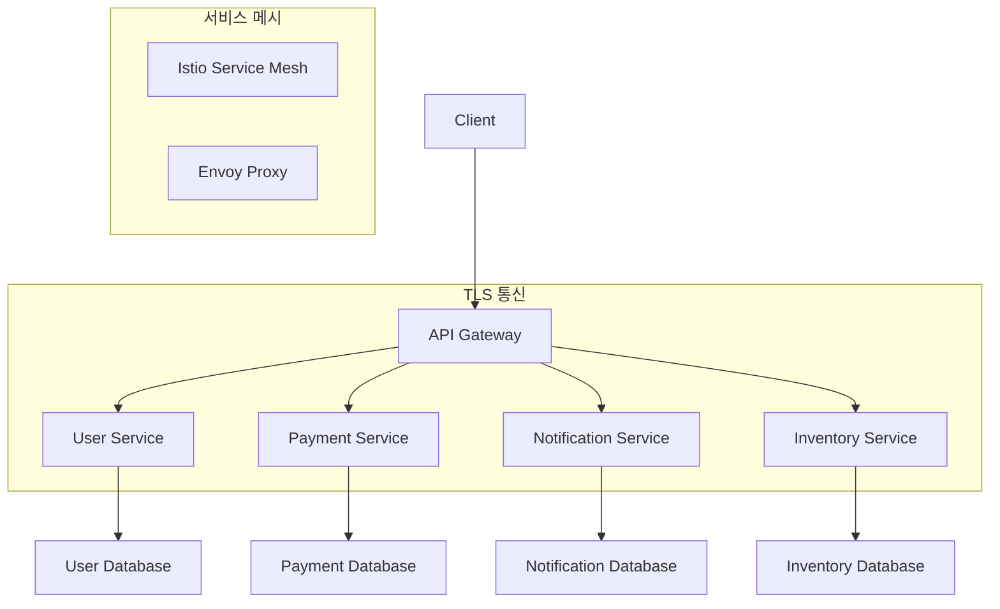

# 마이크로서비스 아키텍처

## 🎯 이 장에서 배울 내용

이 장에서는 마이크로서비스 아키텍처에서 서비스 간 보안 통신을 구현하는 방법을 학습합니다. API Gateway 보안 설정부터 서비스 메시까지, 복잡한 분산 시스템에서 필요한 모든 보안 기술을 다룹니다.

## 🏗️ 마이크로서비스 보안 아키텍처

### 전체 아키텍처 개요



## 🔐 API Gateway 보안 설정

### Kong API Gateway

```yaml
# kong-deployment.yaml
apiVersion: apps/v1
kind: Deployment
metadata:
  name: kong-gateway
spec:
  replicas: 3
  selector:
    matchLabels:
      app: kong-gateway
  template:
    metadata:
      labels:
        app: kong-gateway
    spec:
      containers:
      - name: kong
        image: kong:3.0
        env:
        - name: KONG_DATABASE
          value: "off"
        - name: KONG_DECLARATIVE_CONFIG
          value: "/kong/declarative/kong.yml"
        - name: KONG_PROXY_ACCESS_LOG
          value: "/dev/stdout"
        - name: KONG_ADMIN_ACCESS_LOG
          value: "/dev/stdout"
        - name: KONG_PROXY_ERROR_LOG
          value: "/dev/stderr"
        - name: KONG_ADMIN_ERROR_LOG
          value: "/dev/stderr"
        - name: KONG_ADMIN_LISTEN
          value: "0.0.0.0:8001"
        ports:
        - containerPort: 8000
        - containerPort: 8443
        - containerPort: 8001
        volumeMounts:
        - name: kong-config
          mountPath: /kong/declarative
---
apiVersion: v1
kind: Service
metadata:
  name: kong-gateway-service
spec:
  selector:
    app: kong-gateway
  ports:
  - name: proxy
    port: 80
    targetPort: 8000
  - name: proxy-ssl
    port: 443
    targetPort: 8443
  - name: admin
    port: 8001
    targetPort: 8001
  type: LoadBalancer
```

### Kong 설정 파일

```yaml
# kong.yml
_format_version: "3.0"

services:
- name: user-service
  url: https://user-service:3001
  routes:
  - name: user-route
    paths:
    - /api/users
    methods:
    - GET
    - POST
    - PUT
    - DELETE
  plugins:
  - name: jwt
    config:
      secret_is_base64: false
      key_claim_name: iss
      algorithm: HS256
  - name: rate-limiting
    config:
      minute: 100
      hour: 1000

- name: payment-service
  url: https://payment-service:3002
  routes:
  - name: payment-route
    paths:
    - /api/payments
    methods:
    - GET
    - POST
  plugins:
  - name: jwt
    config:
      secret_is_base64: false
      key_claim_name: iss
      algorithm: HS256
  - name: rate-limiting
    config:
      minute: 50
      hour: 500

consumers:
- username: api-client
  jwt_secrets:
  - key: api-secret-key
    secret: your-secret-key
```

## 🔒 서비스 간 mTLS 통신

### Istio Service Mesh 설정

```yaml
# istio-installation.yaml
apiVersion: install.istio.io/v1alpha1
kind: IstioOperator
metadata:
  namespace: istio-system
  name: control-plane
spec:
  values:
    global:
      mtls:
        enabled: true
      sds:
        enabled: true
  components:
    pilot:
      k8s:
        resources:
          requests:
            cpu: 500m
            memory: 2048Mi
  meshConfig:
    defaultConfig:
      proxyStatsMatcher:
        inclusionRegexps:
        - ".*circuit_breakers.*"
        - ".*upstream_rq_retry.*"
        - ".*_cx_.*"
```

### 서비스별 보안 정책

```yaml
# security-policy.yaml
apiVersion: security.istio.io/v1beta1
kind: PeerAuthentication
metadata:
  name: default
  namespace: production
spec:
  mtls:
    mode: STRICT
---
apiVersion: security.istio.io/v1beta1
kind: AuthorizationPolicy
metadata:
  name: user-service-policy
  namespace: production
spec:
  selector:
    matchLabels:
      app: user-service
  rules:
  - from:
    - source:
        principals: ["cluster.local/ns/production/sa/api-gateway"]
    to:
    - operation:
        methods: ["GET", "POST"]
        paths: ["/api/users"]
---
apiVersion: security.istio.io/v1beta1
kind: AuthorizationPolicy
metadata:
  name: payment-service-policy
  namespace: production
spec:
  selector:
    matchLabels:
      app: payment-service
  rules:
  - from:
    - source:
        principals: ["cluster.local/ns/production/sa/api-gateway"]
    to:
    - operation:
        methods: ["POST"]
        paths: ["/api/payments"]
```

## 🛡️ JWT 기반 인증

### JWT 토큰 생성 서비스

```javascript
// auth-service/server.js
const express = require('express');
const jwt = require('jsonwebtoken');
const crypto = require('crypto');

const app = express();
app.use(express.json());

const JWT_SECRET = process.env.JWT_SECRET || 'your-secret-key';
const JWT_EXPIRES_IN = '1h';

// 사용자 인증
app.post('/auth/login', async (req, res) => {
    const { username, password } = req.body;
    
    // 사용자 인증 로직 (실제로는 데이터베이스에서 확인)
    if (username === 'admin' && password === 'password') {
        const token = jwt.sign(
            { 
                sub: 'admin',
                iss: 'api-client',
                aud: 'microservices',
                exp: Math.floor(Date.now() / 1000) + (60 * 60),
                iat: Math.floor(Date.now() / 1000)
            },
            JWT_SECRET,
            { algorithm: 'HS256' }
        );
        
        res.json({ 
            access_token: token,
            token_type: 'Bearer',
            expires_in: 3600
        });
    } else {
        res.status(401).json({ error: 'Invalid credentials' });
    }
});

// 토큰 검증
app.post('/auth/verify', (req, res) => {
    const { token } = req.body;
    
    try {
        const decoded = jwt.verify(token, JWT_SECRET);
        res.json({ valid: true, payload: decoded });
    } catch (error) {
        res.status(401).json({ valid: false, error: error.message });
    }
});

app.listen(3000, () => {
    console.log('Auth Service running on port 3000');
});
```

### 서비스별 JWT 검증

```javascript
// user-service/middleware/auth.js
const jwt = require('jsonwebtoken');

const JWT_SECRET = process.env.JWT_SECRET || 'your-secret-key';

const authenticateToken = (req, res, next) => {
    const authHeader = req.headers['authorization'];
    const token = authHeader && authHeader.split(' ')[1];
    
    if (!token) {
        return res.status(401).json({ error: 'Access token required' });
    }
    
    jwt.verify(token, JWT_SECRET, (err, user) => {
        if (err) {
            return res.status(403).json({ error: 'Invalid token' });
        }
        
        req.user = user;
        next();
    });
};

module.exports = { authenticateToken };
```

## 🔄 서비스 디스커버리 보안

### Consul 서비스 메시

```yaml
# consul-config.yaml
apiVersion: v1
kind: ConfigMap
metadata:
  name: consul-config
data:
  consul.json: |
    {
      "datacenter": "dc1",
      "data_dir": "/consul/data",
      "log_level": "INFO",
      "node_name": "consul-server",
      "server": true,
      "bootstrap_expect": 3,
      "retry_join": ["consul-server-0", "consul-server-1", "consul-server-2"],
      "ui_config": {
        "enabled": true
      },
      "connect": {
        "enabled": true
      },
      "ports": {
        "grpc": 8502
      },
      "connect": {
        "enabled": true,
        "ca_provider": "consul"
      }
    }
```

### 서비스 등록 및 보안

```yaml
# service-registration.yaml
apiVersion: v1
kind: ConfigMap
metadata:
  name: user-service-config
data:
  service.json: |
    {
      "service": {
        "name": "user-service",
        "port": 3001,
        "connect": {
          "sidecar_service": {
            "port": 20000,
            "check": {
              "name": "connect-proxy-user-service",
              "tcp": "127.0.0.1:20000",
              "interval": "10s"
            }
          }
        },
        "check": {
          "name": "user-service-health",
          "http": "https://localhost:3001/health",
          "interval": "10s",
          "tls_skip_verify": true
        }
      }
    }
```

## 📊 모니터링 및 보안 감사

### 보안 이벤트 모니터링

```yaml
# security-monitoring.yaml
apiVersion: v1
kind: ConfigMap
metadata:
  name: security-monitoring-config
data:
  fluent-bit.conf: |
    [SERVICE]
        Flush         1
        Log_Level     info
        Daemon        off
        Parsers_File  parsers.conf
        HTTP_Server   On
        HTTP_Listen   0.0.0.0
        HTTP_Port     2020

    [INPUT]
        Name              tail
        Path              /var/log/nginx/access.log
        Parser            nginx
        Tag               nginx.access
        Refresh_Interval  5

    [FILTER]
        Name                grep
        Match               nginx.access
        Regex               status (4[0-9][0-9]|5[0-9][0-9])

    [OUTPUT]
        Name                es
        Match               *
        Host                elasticsearch
        Port                9200
        Index               security-logs
        Type                _doc
```

### 보안 메트릭 수집

```yaml
# security-metrics.yaml
apiVersion: v1
kind: ServiceMonitor
metadata:
  name: security-metrics
  namespace: monitoring
spec:
  selector:
    matchLabels:
      app: kong-gateway
  endpoints:
  - port: admin
    interval: 30s
    path: /metrics
```

## 🔧 문제 해결

### 일반적인 문제들

#### 1. 서비스 간 통신 실패
```bash
# Istio 프록시 상태 확인
kubectl get pods -n production
kubectl logs -n production deployment/user-service -c istio-proxy

# mTLS 설정 확인
kubectl get peerauthentication -n production
kubectl describe peerauthentication default -n production
```

#### 2. JWT 토큰 검증 실패
```bash
# JWT 토큰 디코딩
echo "YOUR_JWT_TOKEN" | base64 -d

# Kong JWT 플러그인 상태 확인
curl -X GET http://kong-gateway:8001/plugins
```

#### 3. 서비스 디스커버리 문제
```bash
# Consul 서비스 상태 확인
consul catalog services
consul catalog service user-service

# DNS 확인
nslookup user-service.service.consul
```

## 📚 다음 단계

마이크로서비스 보안을 완료했다면 다음 단계로 진행하세요:

- **[CI/CD 통합](./03-ci-cd-integration.md)** - 자동화된 보안 배포
- **[고급 주제](../advanced/README.md)** - 전문가 수준의 인증서 관리
- **[문제 해결](../troubleshooting/README.md)** - 운영 중 발생하는 문제들

## 💡 핵심 정리

- **API Gateway**: 중앙 집중식 보안 정책 관리
- **mTLS**: 서비스 간 상호 인증 및 암호화
- **JWT**: 토큰 기반 인증 및 권한 관리
- **서비스 메시**: 투명한 보안 정책 적용
- **모니터링**: 실시간 보안 이벤트 감지

---

**다음: [CI/CD 통합](./03-ci-cd-integration.md)**
