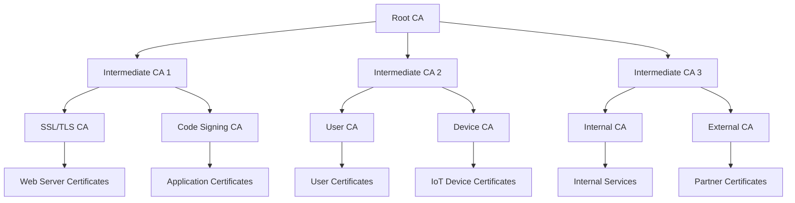

# PKI 설계

## 🎯 이 장에서 배울 내용

이 장에서는 엔터프라이즈급 공개키 인프라(PKI) 설계 방법을 학습합니다. 계층적 CA 구조부터 정책 수립까지, 대규모 환경에서 필요한 전문적인 PKI 설계 지식을 다룹니다.

## 🏗️ PKI 아키텍처 설계

### 계층적 CA 구조

#### 3계층 PKI 구조


#### Root CA 설계
```bash
#!/bin/bash
# root-ca-setup.sh

CA_DIR="/opt/pki/root-ca"
CA_NAME="Enterprise Root CA"

echo "🏗️ Root CA 설계 및 구축 시작..."

# 디렉토리 구조 생성
mkdir -p $CA_DIR/{certs,private,crl,newcerts,csr,conf}
mkdir -p $CA_DIR/backup/{$(date +%Y%m%d)}

# Root CA 개인키 생성 (4096비트, 하드웨어 보안 모듈 권장)
openssl genrsa -out $CA_DIR/private/root-ca.key 4096

# Root CA 인증서 생성 (20년 유효)
openssl req -new -x509 -days 7300 -key $CA_DIR/private/root-ca.key \
    -out $CA_DIR/certs/root-ca.crt \
    -subj "/C=KR/ST=Seoul/L=Seoul/O=Enterprise/OU=IT/CN=$CA_NAME"

# Root CA 설정 파일 생성
cat > $CA_DIR/conf/root-ca.conf << 'EOF'
[ ca ]
default_ca = CA_default

[ CA_default ]
dir = /opt/pki/root-ca
certs = $dir/certs
crl_dir = $dir/crl
new_certs_dir = $dir/newcerts
database = $dir/index.txt
serial = $dir/serial
RANDFILE = $dir/.rand

private_key = $dir/private/root-ca.key
certificate = $dir/certs/root-ca.crt

crlnumber = $dir/crlnumber
crl = $dir/crl/root-ca.crl
crl_extensions = crl_ext
default_crl_days = 30

default_md = sha256
name_opt = ca_default
cert_opt = ca_default
default_days = 3650
preserve = no
policy = policy_strict

[ policy_strict ]
countryName = match
stateOrProvinceName = match
organizationName = match
organizationalUnitName = optional
commonName = supplied
emailAddress = optional

[ req ]
default_bits = 4096
distinguished_name = req_distinguished_name
string_mask = utf8only
default_md = sha256
x509_extensions = v3_ca

[ req_distinguished_name ]
countryName = Country Name (2 letter code)
stateOrProvinceName = State or Province Name
localityName = Locality Name
0.organizationName = Organization Name
organizationalUnitName = Organizational Unit Name
commonName = Common Name
emailAddress = Email Address

[ v3_ca ]
subjectKeyIdentifier = hash
authorityKeyIdentifier = keyid:always,issuer
basicConstraints = critical, CA:true
keyUsage = critical, digitalSignature, cRLSign, keyCertSign
crlDistributionPoints = URI:http://crl.enterprise.com/root-ca.crl
authorityInfoAccess = OCSP;URI:http://ocsp.enterprise.com

[ crl_ext ]
authorityKeyIdentifier = keyid:always
EOF

# CA 데이터베이스 초기화
touch $CA_DIR/index.txt
echo 1000 > $CA_DIR/serial
echo 1000 > $CA_DIR/crlnumber

# 보안 설정
chmod 700 $CA_DIR/private
chmod 600 $CA_DIR/private/root-ca.key
chmod 644 $CA_DIR/certs/root-ca.crt

echo "✅ Root CA 구축 완료"
```

### Intermediate CA 설계

#### SSL/TLS Intermediate CA
```bash
#!/bin/bash
# ssl-intermediate-ca-setup.sh

ROOT_CA_DIR="/opt/pki/root-ca"
INTERMEDIATE_CA_DIR="/opt/pki/ssl-ca"
CA_NAME="Enterprise SSL/TLS CA"

echo "🔐 SSL/TLS Intermediate CA 구축 시작..."

# 디렉토리 구조 생성
mkdir -p $INTERMEDIATE_CA_DIR/{certs,private,crl,newcerts,csr,conf}

# Intermediate CA 개인키 생성
openssl genrsa -out $INTERMEDIATE_CA_DIR/private/ssl-ca.key 4096

# Intermediate CA CSR 생성
openssl req -new -key $INTERMEDIATE_CA_DIR/private/ssl-ca.key \
    -out $INTERMEDIATE_CA_DIR/csr/ssl-ca.csr \
    -subj "/C=KR/ST=Seoul/L=Seoul/O=Enterprise/OU=IT/CN=$CA_NAME"

# Intermediate CA 설정 파일 생성
cat > $INTERMEDIATE_CA_DIR/conf/ssl-ca.conf << 'EOF'
[ ca ]
default_ca = CA_default

[ CA_default ]
dir = /opt/pki/ssl-ca
certs = $dir/certs
crl_dir = $dir/crl
new_certs_dir = $dir/newcerts
database = $dir/index.txt
serial = $dir/serial
RANDFILE = $dir/.rand

private_key = $dir/private/ssl-ca.key
certificate = $dir/certs/ssl-ca.crt

crlnumber = $dir/crlnumber
crl = $dir/crl/ssl-ca.crl
crl_extensions = crl_ext
default_crl_days = 30

default_md = sha256
name_opt = ca_default
cert_opt = ca_default
default_days = 365
preserve = no
policy = policy_strict

[ policy_strict ]
countryName = match
stateOrProvinceName = match
organizationName = match
organizationalUnitName = optional
commonName = supplied
emailAddress = optional

[ req ]
default_bits = 4096
distinguished_name = req_distinguished_name
string_mask = utf8only
default_md = sha256
x509_extensions = v3_intermediate_ca

[ req_distinguished_name ]
countryName = Country Name (2 letter code)
stateOrProvinceName = State or Province Name
localityName = Locality Name
0.organizationName = Organization Name
organizationalUnitName = Organizational Unit Name
commonName = Common Name
emailAddress = Email Address

[ v3_intermediate_ca ]
subjectKeyIdentifier = hash
authorityKeyIdentifier = keyid:always,issuer
basicConstraints = critical, CA:true, pathlen:0
keyUsage = critical, digitalSignature, cRLSign, keyCertSign
crlDistributionPoints = URI:http://crl.enterprise.com/ssl-ca.crl
authorityInfoAccess = OCSP;URI:http://ocsp.enterprise.com

[ server_cert ]
basicConstraints = CA:FALSE
nsCertType = server
nsComment = "SSL/TLS Server Certificate"
subjectKeyIdentifier = hash
authorityKeyIdentifier = keyid,issuer:always
keyUsage = critical, digitalSignature, keyEncipherment
extendedKeyUsage = serverAuth
crlDistributionPoints = URI:http://crl.enterprise.com/ssl-ca.crl
authorityInfoAccess = OCSP;URI:http://ocsp.enterprise.com

[ crl_ext ]
authorityKeyIdentifier = keyid:always
EOF

# Root CA로 Intermediate CA 서명
openssl ca -config $ROOT_CA_DIR/conf/root-ca.conf -extensions v3_intermediate_ca \
    -days 3650 -notext -md sha256 \
    -in $INTERMEDIATE_CA_DIR/csr/ssl-ca.csr \
    -out $INTERMEDIATE_CA_DIR/certs/ssl-ca.crt

# CA 데이터베이스 초기화
touch $INTERMEDIATE_CA_DIR/index.txt
echo 1000 > $INTERMEDIATE_CA_DIR/serial
echo 1000 > $INTERMEDIATE_CA_DIR/crlnumber

# 보안 설정
chmod 700 $INTERMEDIATE_CA_DIR/private
chmod 600 $INTERMEDIATE_CA_DIR/private/ssl-ca.key
chmod 644 $INTERMEDIATE_CA_DIR/certs/ssl-ca.crt

echo "✅ SSL/TLS Intermediate CA 구축 완료"
```

## 📋 PKI 정책 및 절차

### 인증서 정책 문서

#### 인증서 프로파일 정의
```yaml
# certificate-profiles.yaml
profiles:
  web_server:
    validity_period: 365
    key_size: 2048
    key_algorithm: RSA
    signature_algorithm: SHA256
    key_usage:
      - digitalSignature
      - keyEncipherment
    extended_key_usage:
      - serverAuth
    subject_alternative_names: true
    crl_distribution_points: true
    ocsp_responder: true
    
  user_certificate:
    validity_period: 365
    key_size: 2048
    key_algorithm: RSA
    signature_algorithm: SHA256
    key_usage:
      - digitalSignature
      - keyEncipherment
    extended_key_usage:
      - clientAuth
      - emailProtection
    subject_alternative_names: false
    crl_distribution_points: true
    ocsp_responder: true
    
  code_signing:
    validity_period: 1095
    key_size: 4096
    key_algorithm: RSA
    signature_algorithm: SHA256
    key_usage:
      - digitalSignature
    extended_key_usage:
      - codeSigning
    subject_alternative_names: false
    crl_distribution_points: true
    ocsp_responder: true
```

#### 인증서 발급 절차
```bash
#!/bin/bash
# certificate-issuance-process.sh

CA_DIR="/opt/pki/ssl-ca"
REQUEST_DIR="/opt/pki/requests"
APPROVAL_DIR="/opt/pki/approvals"

echo "📋 인증서 발급 절차 시작..."

# 1. 요청 검증
validate_request() {
    local csr_file=$1
    local request_type=$2
    
    echo "🔍 요청 검증 중..."
    
    # CSR 형식 검증
    openssl req -in $csr_file -text -noout > /dev/null
    if [ $? -ne 0 ]; then
        echo "❌ CSR 형식 오류"
        return 1
    fi
    
    # 주체 정보 검증
    local subject=$(openssl req -in $csr_file -noout -subject)
    echo "주체: $subject"
    
    # 도메인 소유권 검증 (웹서버 인증서의 경우)
    if [ "$request_type" = "web_server" ]; then
        validate_domain_ownership $csr_file
    fi
    
    echo "✅ 요청 검증 완료"
    return 0
}

# 2. 승인 프로세스
approval_process() {
    local csr_file=$1
    local approver=$2
    
    echo "📝 승인 프로세스 시작..."
    
    # 승인자 권한 확인
    if ! check_approver_permissions $approver; then
        echo "❌ 승인자 권한 부족"
        return 1
    fi
    
    # 승인 로그 기록
    echo "$(date): $approver approved $csr_file" >> $APPROVAL_DIR/approval.log
    
    echo "✅ 승인 완료"
    return 0
}

# 3. 인증서 발급
issue_certificate() {
    local csr_file=$1
    local profile=$2
    
    echo "🔐 인증서 발급 중..."
    
    # 프로파일별 설정 적용
    local config_file="/opt/pki/ssl-ca/conf/${profile}.conf"
    
    # 인증서 발급
    openssl ca -config $CA_DIR/conf/ssl-ca.conf \
        -extensions $profile \
        -days 365 \
        -notext \
        -md sha256 \
        -in $csr_file \
        -out $CA_DIR/certs/$(basename $csr_file .csr).crt
    
    if [ $? -eq 0 ]; then
        echo "✅ 인증서 발급 완료"
        return 0
    else
        echo "❌ 인증서 발급 실패"
        return 1
    fi
}

# 메인 프로세스
main() {
    local csr_file=$1
    local request_type=$2
    local approver=$3
    
    # 1. 요청 검증
    validate_request $csr_file $request_type || exit 1
    
    # 2. 승인 프로세스
    approval_process $csr_file $approver || exit 1
    
    # 3. 인증서 발급
    issue_certificate $csr_file $request_type || exit 1
    
    echo "🎉 인증서 발급 프로세스 완료"
}

main "$@"
```

## 🔒 보안 정책 및 제어

### 접근 제어 정책

#### RBAC 설정
```yaml
# pki-rbac.yaml
apiVersion: v1
kind: ConfigMap
metadata:
  name: pki-rbac-config
data:
  roles.yaml: |
    roles:
      - name: pki-admin
        permissions:
          - "pki:ca:manage"
          - "pki:certificate:issue"
          - "pki:certificate:revoke"
          - "pki:crl:generate"
        users:
          - "admin@enterprise.com"
          - "security-team@enterprise.com"
      
      - name: pki-operator
        permissions:
          - "pki:certificate:issue"
          - "pki:certificate:view"
        users:
          - "devops-team@enterprise.com"
          - "operations@enterprise.com"
      
      - name: pki-auditor
        permissions:
          - "pki:certificate:view"
          - "pki:audit:read"
        users:
          - "audit-team@enterprise.com"
```

#### 감사 로깅
```bash
#!/bin/bash
# pki-audit-logger.sh

AUDIT_LOG="/var/log/pki/audit.log"
CA_DIR="/opt/pki"

log_audit_event() {
    local event_type=$1
    local user=$2
    local resource=$3
    local action=$4
    local result=$5
    
    echo "$(date -Iseconds): EVENT=$event_type USER=$user RESOURCE=$resource ACTION=$action RESULT=$result" >> $AUDIT_LOG
}

# 인증서 발급 감사
audit_certificate_issuance() {
    local user=$1
    local certificate=$2
    local result=$3
    
    log_audit_event "CERTIFICATE_ISSUANCE" "$user" "$certificate" "ISSUE" "$result"
}

# 인증서 폐기 감사
audit_certificate_revocation() {
    local user=$1
    local certificate=$2
    local reason=$3
    
    log_audit_event "CERTIFICATE_REVOCATION" "$user" "$certificate" "REVOKE" "$reason"
}

# CA 관리 감사
audit_ca_management() {
    local user=$1
    local ca=$2
    local action=$3
    local result=$4
    
    log_audit_event "CA_MANAGEMENT" "$user" "$ca" "$action" "$result"
}
```

### 하드웨어 보안 모듈 (HSM) 통합

#### HSM 설정
```bash
#!/bin/bash
# hsm-setup.sh

HSM_SLOT=1
HSM_PIN="12345678"
CA_LABEL="Enterprise Root CA"

echo "🔐 HSM 통합 설정 시작..."

# HSM 토큰 초기화
pkcs11-tool --module /usr/lib/librtpkcs11ecp.so --init-token --slot $HSM_SLOT --label "$CA_LABEL"

# HSM 키 생성
pkcs11-tool --module /usr/lib/librtpkcs11ecp.so --slot $HSM_SLOT --login --pin $HSM_PIN \
    --keypairgen --key-type EC:secp256r1 --id 1 --label "Root CA Key"

# HSM 인증서 생성
openssl req -engine pkcs11 -keyform engine -key "pkcs11:slot-id=$HSM_SLOT;id=1" \
    -new -x509 -days 7300 -out root-ca-hsm.crt \
    -subj "/C=KR/ST=Seoul/L=Seoul/O=Enterprise/OU=IT/CN=Enterprise Root CA"

echo "✅ HSM 통합 설정 완료"
```

## 📊 PKI 모니터링 및 관리

### PKI 상태 모니터링

#### 종합 모니터링 대시보드
```python
#!/usr/bin/env python3
# pki-monitor.py

import json
import subprocess
import time
from datetime import datetime, timedelta
from prometheus_client import start_http_server, Gauge, Counter

# 메트릭 정의
certificates_total = Gauge('pki_certificates_total', 'Total number of certificates', ['status'])
certificates_expiring = Gauge('pki_certificates_expiring', 'Certificates expiring in next 30 days')
crl_last_update = Gauge('pki_crl_last_update_seconds', 'Last CRL update timestamp')
ocsp_requests_total = Counter('pki_ocsp_requests_total', 'Total OCSP requests', ['status'])

class PKIMonitor:
    def __init__(self, ca_dir="/opt/pki"):
        self.ca_dir = ca_dir
        
    def get_certificate_count(self):
        """인증서 개수 조회"""
        try:
            result = subprocess.run([
                'openssl', 'ca', '-config', f'{self.ca_dir}/ssl-ca/conf/ssl-ca.conf',
                '-list_certs'
            ], capture_output=True, text=True)
            
            # 결과 파싱 (실제 구현에서는 더 정교한 파싱 필요)
            return len(result.stdout.split('\n'))
        except Exception as e:
            print(f"인증서 개수 조회 오류: {e}")
            return 0
    
    def get_expiring_certificates(self):
        """만료 예정 인증서 조회"""
        expiring_count = 0
        thirty_days_from_now = datetime.now() + timedelta(days=30)
        
        try:
            # 인증서 데이터베이스에서 만료 예정 인증서 확인
            with open(f'{self.ca_dir}/ssl-ca/index.txt', 'r') as f:
                for line in f:
                    if line.startswith('V'):  # 유효한 인증서
                        parts = line.strip().split('\t')
                        if len(parts) >= 2:
                            expiry_date = datetime.strptime(parts[1], '%Y%m%d%H%M%SZ')
                            if expiry_date <= thirty_days_from_now:
                                expiring_count += 1
        except Exception as e:
            print(f"만료 예정 인증서 조회 오류: {e}")
            
        return expiring_count
    
    def get_crl_status(self):
        """CRL 상태 조회"""
        try:
            crl_file = f'{self.ca_dir}/ssl-ca/crl/ssl-ca.crl'
            result = subprocess.run([
                'stat', '-c', '%Y', crl_file
            ], capture_output=True, text=True)
            
            if result.returncode == 0:
                return int(result.stdout.strip())
        except Exception as e:
            print(f"CRL 상태 조회 오류: {e}")
            
        return 0
    
    def update_metrics(self):
        """메트릭 업데이트"""
        # 인증서 개수
        cert_count = self.get_certificate_count()
        certificates_total.labels(status='valid').set(cert_count)
        
        # 만료 예정 인증서
        expiring_count = self.get_expiring_certificates()
        certificates_expiring.set(expiring_count)
        
        # CRL 마지막 업데이트
        crl_timestamp = self.get_crl_status()
        crl_last_update.set(crl_timestamp)
        
        print(f"메트릭 업데이트 완료: 인증서 {cert_count}개, 만료 예정 {expiring_count}개")

def main():
    monitor = PKIMonitor()
    
    # Prometheus 메트릭 서버 시작
    start_http_server(8000)
    print("PKI 모니터링 서버 시작: http://localhost:8000/metrics")
    
    # 주기적으로 메트릭 업데이트
    while True:
        monitor.update_metrics()
        time.sleep(60)

if __name__ == '__main__':
    main()
```

## 📚 다음 단계

PKI 설계를 완료했다면 다음 단계로 진행하세요:

- **[인증서 로테이션](./02-certificate-rotation.md)** - 무중단 인증서 교체
- **[모니터링 및 알림](./03-monitoring-alerts.md)** - 고급 모니터링 시스템
- **[실제 시나리오](../scenarios/README.md)** - 복잡한 아키텍처 적용

## 💡 핵심 정리

- **계층적 구조**: Root CA → Intermediate CA → End Entity Certificate
- **정책 수립**: 명확한 인증서 프로파일과 발급 절차 정의
- **보안 제어**: RBAC, 감사 로깅, HSM 통합
- **모니터링**: 실시간 PKI 상태 모니터링 및 알림
- **규정 준수**: 엔터프라이즈 보안 요구사항 충족

---

**다음: [인증서 로테이션](./02-certificate-rotation.md)**
