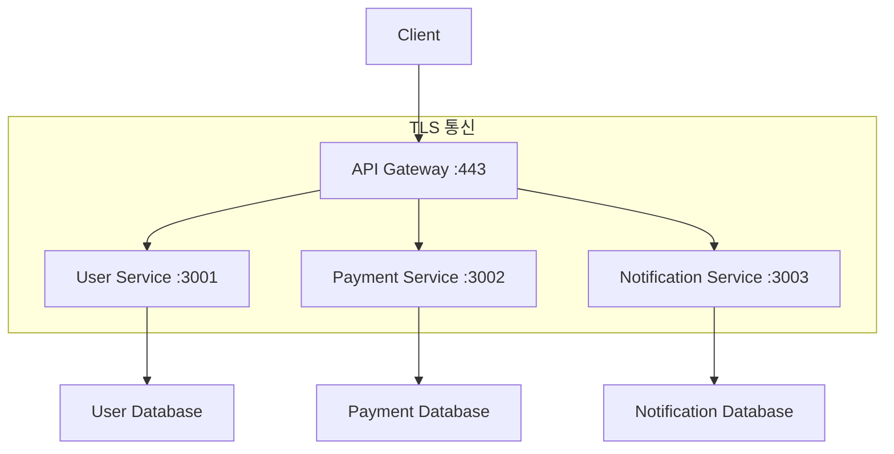

# 마이크로서비스 예제

이 폴더에는 마이크로서비스 아키텍처에서 서비스 간 보안 통신을 구현한 예제들이 포함되어 있습니다.

## 📁 파일 구조

```
microservices/
├── api-gateway/
│   ├── nginx.conf          # API Gateway 설정
│   ├── docker-compose.yml  # Gateway 컨테이너
│   └── ssl/                # SSL 인증서
├── user-service/
│   ├── server.js           # 사용자 서비스
│   ├── package.json        # 의존성 관리
│   └── docker-compose.yml  # 서비스 컨테이너
├── payment-service/
│   ├── server.js           # 결제 서비스
│   ├── package.json        # 의존성 관리
│   └── docker-compose.yml  # 서비스 컨테이너
├── notification-service/
│   ├── server.js           # 알림 서비스
│   ├── package.json        # 의존성 관리
│   └── docker-compose.yml  # 서비스 컨테이너
├── docker-compose.yml      # 전체 스택
└── scripts/
    ├── generate-certs.sh   # 인증서 생성 스크립트
    └── setup.sh            # 환경 설정 스크립트
```

## 🏗️ 아키텍처 개요



## 🚀 빠른 시작

### 1. 환경 설정
```bash
# 인증서 생성
./scripts/generate-certs.sh

# 전체 스택 실행
docker-compose up -d

# 서비스 상태 확인
docker-compose ps
```

### 2. 서비스 테스트
```bash
# API Gateway를 통한 사용자 조회
curl -k https://localhost/api/users

# 결제 처리
curl -k -X POST https://localhost/api/payments \
  -H "Content-Type: application/json" \
  -d '{"fromUserId": 1, "toUserId": 2, "amount": 10000}'
```

## 🔐 보안 설정

### 서비스 간 TLS 통신
- 각 서비스는 고유한 인증서 사용
- API Gateway가 클라이언트 인증서 검증
- 서비스 간 상호 TLS 인증

### 인증서 관리
```bash
# Root CA 생성
openssl genrsa -out ca-key.pem 4096
openssl req -new -x509 -days 3650 -key ca-key.pem -out ca-cert.pem

# 각 서비스별 인증서 생성
for service in api-gateway user-service payment-service notification-service; do
    openssl genrsa -out ${service}-key.pem 4096
    openssl req -new -key ${service}-key.pem -out ${service}.csr
    openssl x509 -req -in ${service}.csr -CA ca-cert.pem -CAkey ca-key.pem -out ${service}-cert.pem
done
```

## 📊 모니터링 및 로깅

### 서비스 상태 확인
```bash
# 각 서비스 헬스체크
curl -k https://localhost/api/users/health
curl -k https://localhost/api/payments/health
curl -k https://localhost/api/notifications/health
```

### 로그 확인
```bash
# 전체 로그
docker-compose logs

# 특정 서비스 로그
docker-compose logs user-service
docker-compose logs payment-service
```

## 🔧 설정 파일 예시

### API Gateway (Nginx)
```nginx
upstream user_service {
    server user-service:3001;
}

upstream payment_service {
    server payment-service:3002;
}

server {
    listen 443 ssl;
    server_name localhost;
    
    ssl_certificate /etc/ssl/certs/api-gateway-cert.pem;
    ssl_certificate_key /etc/ssl/private/api-gateway-key.pem;
    
    location /api/users {
        proxy_pass https://user_service;
        proxy_ssl_certificate /etc/ssl/certs/api-gateway-cert.pem;
        proxy_ssl_certificate_key /etc/ssl/private/api-gateway-key.pem;
        proxy_ssl_trusted_certificate /etc/ssl/certs/ca-cert.pem;
        proxy_ssl_verify on;
    }
}
```

### User Service (Node.js)
```javascript
const express = require('express');
const https = require('https');
const fs = require('fs');

const app = express();

const sslOptions = {
    key: fs.readFileSync('/etc/ssl/private/user-service-key.pem'),
    cert: fs.readFileSync('/etc/ssl/certs/user-service-cert.pem'),
    ca: fs.readFileSync('/etc/ssl/certs/ca-cert.pem'),
    requestCert: true,
    rejectUnauthorized: true
};

app.get('/api/users', (req, res) => {
    res.json({ users: [] });
});

https.createServer(sslOptions, app).listen(3001, () => {
    console.log('User Service running on HTTPS port 3001');
});
```

## 🧪 테스트 시나리오

### 1. 기본 기능 테스트
```bash
# 사용자 목록 조회
curl -k https://localhost/api/users

# 사용자 생성
curl -k -X POST https://localhost/api/users \
  -H "Content-Type: application/json" \
  -d '{"name": "John Doe", "email": "john@example.com"}'
```

### 2. 보안 테스트
```bash
# 잘못된 인증서로 접근 시도
curl -k --cert wrong-cert.pem --key wrong-key.pem https://localhost/api/users
# 결과: 400 Bad Request (인증서 검증 실패)
```

### 3. 부하 테스트
```bash
# Apache Bench를 사용한 부하 테스트
ab -n 1000 -c 10 -k https://localhost/api/users
```

## 🔍 문제 해결

### 일반적인 문제
1. **서비스 간 통신 실패**
   - 해결: 인증서 체인 확인, 네트워크 설정 검토

2. **API Gateway 라우팅 오류**
   - 해결: upstream 설정 확인, 서비스 상태 점검

3. **인증서 검증 실패**
   - 해결: CA 인증서 설치, 인증서 만료일 확인

## 📖 추가 학습

- [실제 시나리오](../../docs/scenarios/02-microservices.md)
- [문제 해결 가이드](../../docs/troubleshooting/README.md)
- [고급 주제](../../docs/advanced/README.md)

---

**💡 팁**: 각 서비스를 개별적으로 실행하여 문제를 격리할 수 있습니다!
